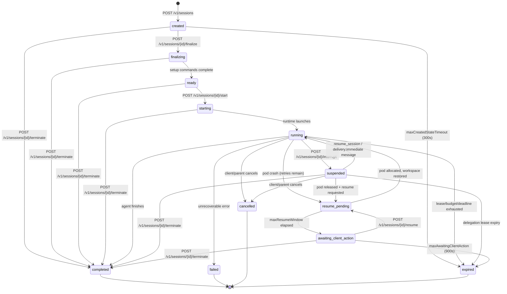

# Session Lifecycle

A Lenny session is a managed execution environment for an agent runtime. This page covers the complete session state machine, step-by-step API calls for each lifecycle phase, and all associated operations.

---

## Session State Machine



### State Descriptions

| State | Description | Terminal? |
|---|---|---|
| `created` | Session created; pod claimed and credentials assigned. Awaiting file uploads or finalization. TTL: `maxCreatedStateTimeoutSeconds` (default 300s). | No |
| `finalizing` | Workspace materialization and setup commands in progress. | No |
| `ready` | Setup complete, awaiting `start`. | No |
| `starting` | Agent runtime is launching. | No |
| `running` | Agent is actively executing. May also be in `input_required` sub-state. | No |
| `suspended` | Agent paused via `interrupt`; pod held, workspace preserved. | No |
| `resume_pending` | Pod failed; gateway is retrying on a new pod. | No |
| `awaiting_client_action` | Retries exhausted or resume window elapsed; client must explicitly resume or terminate. | No |
| `completed` | Agent finished successfully. | Yes |
| `failed` | Unrecoverable error. | Yes |
| `cancelled` | Cancelled by client or parent. | Yes |
| `expired` | Lease, budget, or deadline exhausted. | Yes |

---

## Step-by-Step Lifecycle

### a. Create Session

```
POST /v1/sessions
Content-Type: application/json
Authorization: Bearer <token>

{
  "runtime": "claude-worker",
  "pool": "default-pool",
  "labels": {
    "project": "my-app",
    "environment": "staging"
  },
  "retryPolicy": {
    "mode": "auto_then_client",
    "maxRetries": 2,
    "retryableFailures": ["pod_evicted", "node_lost", "runtime_crash"],
    "maxSessionAgeSeconds": 7200,
    "maxResumeWindowSeconds": 900
  },
  "metadata": {
    "description": "Code review session"
  }
}
```

**Response** (`201 Created`):

```json
{
  "sessionId": "sess_abc123",
  "uploadToken": "sess_abc123.1712345678.a1b2c3d4e5f6...",
  "sessionIsolationLevel": {
    "executionMode": "session",
    "isolationProfile": "gvisor",
    "podReuse": false
  },
  "state": "created",
  "createdAt": "2026-01-15T10:30:00Z"
}
```

The `uploadToken` is a short-lived, session-scoped HMAC-SHA256 token. Treat it as a secret -- do not log it or include it in URLs. It expires at `session_creation_time + maxCreatedStateTimeoutSeconds`.

### b. Upload Files

```
POST /v1/sessions/sess_abc123/upload
Content-Type: multipart/form-data
Authorization: Bearer <token>
X-Upload-Token: sess_abc123.1712345678.a1b2c3d4e5f6...

--boundary
Content-Disposition: form-data; name="files"; filename="main.py"
Content-Type: application/octet-stream

<file contents>
--boundary
Content-Disposition: form-data; name="files"; filename="config.yaml"
Content-Type: application/octet-stream

<file contents>
--boundary--
```

**Response** (`200 OK`):

```json
{
  "uploaded": [
    {"path": "main.py", "size": 1234},
    {"path": "config.yaml", "size": 567}
  ]
}
```

**Upload rules:**
- All paths are relative to the workspace root
- Paths with `..`, absolute paths, and symlinks are rejected
- Per-file and total session size limits are enforced
- Supported archive formats: `tar.gz`, `tar.bz2`, `zip` (extracted automatically)
- Zip bomb protection: decompression ratio limit (default 100:1)

### c. Finalize Workspace

```
POST /v1/sessions/sess_abc123/finalize
Authorization: Bearer <token>
X-Upload-Token: sess_abc123.1712345678.a1b2c3d4e5f6...
```

**Response** (`200 OK`):

```json
{
  "state": "ready",
  "setupOutput": {
    "commands": [
      {
        "command": "pip install -r requirements.txt",
        "exitCode": 0,
        "durationMs": 3200
      }
    ]
  }
}
```

Finalization validates the staging area, materializes the workspace, and runs any setup commands configured on the runtime. The upload token is consumed -- it cannot be reused after this call.

### d. Start Session

```
POST /v1/sessions/sess_abc123/start
Authorization: Bearer <token>
```

**Response** (`200 OK`):

```json
{
  "state": "running",
  "startedAt": "2026-01-15T10:30:05Z"
}
```

The agent runtime launches and begins executing. You can now send messages and receive streaming output.

### e. Send Messages

```
POST /v1/sessions/sess_abc123/messages
Content-Type: application/json
Authorization: Bearer <token>

{
  "parts": [
    {
      "type": "text",
      "text": "Review the code in main.py and suggest improvements."
    }
  ]
}
```

**Response** (`200 OK`):

```json
{
  "messageId": "msg_xyz789",
  "deliveryReceipt": {
    "status": "delivered",
    "timestamp": "2026-01-15T10:30:06Z"
  }
}
```

**Delivery semantics** vary by session state:

| Session State | Behavior |
|---|---|
| `running` (runtime available) | Delivered to runtime stdin |
| `running` (tool call in flight) | Buffered in session inbox, delivered when runtime is ready |
| `suspended` | Buffered in inbox; with `delivery: "immediate"`, atomically resumes and delivers |
| `resume_pending` / `awaiting_client_action` | Enqueued in dead-letter queue with TTL |
| Pre-running (`created`, `ready`, `starting`) | Rejected with `TARGET_NOT_READY` for external clients |
| Terminal | Rejected with `TARGET_TERMINAL` |

### f. Interrupt (Suspend)

```
POST /v1/sessions/sess_abc123/interrupt
Authorization: Bearer <token>
```

**Response** (`200 OK`):

```json
{
  "state": "suspended",
  "suspendedAt": "2026-01-15T10:35:00Z"
}
```

Valid only when the session is `running`. The agent receives an interrupt signal and pauses. The pod is held for up to `maxSuspendedPodHoldSeconds` (default 900s) before being released.

### g. Resume

Resume a session that is in `awaiting_client_action` (after automatic retries are exhausted):

```
POST /v1/sessions/sess_abc123/resume
Authorization: Bearer <token>
```

**Response** (`200 OK`):

```json
{
  "state": "resume_pending",
  "resumeRequestedAt": "2026-01-15T10:40:00Z"
}
```

The gateway allocates a new pod, restores the workspace from the latest checkpoint, and resumes the session. The state transitions from `resume_pending` to `running` once the pod is ready.

For suspended sessions, send a message with `delivery: "immediate"` to trigger automatic resume, or wait for the client to call `resume_session` via MCP.

### h. Terminate

```
POST /v1/sessions/sess_abc123/terminate
Authorization: Bearer <token>
```

**Response** (`200 OK`):

```json
{
  "state": "completed",
  "terminatedAt": "2026-01-15T10:45:00Z"
}
```

Valid in any non-terminal state. Initiates graceful shutdown: the agent receives a termination signal, the workspace is sealed and exported, and artifacts are persisted.

### i. Delete (Force Terminate + Cleanup)

```
DELETE /v1/sessions/sess_abc123
Authorization: Bearer <token>
```

**Response** (`200 OK`):

```json
{
  "state": "cancelled"
}
```

Force-terminates the session and cleans up all resources. Equivalent to terminate + cleanup in one call.

---

## Convenience Endpoint: Create + Start in One Call

For simple workflows, skip the multi-step process:

```
POST /v1/sessions/start
Content-Type: application/json
Authorization: Bearer <token>

{
  "runtime": "claude-worker",
  "pool": "default-pool",
  "inlineFiles": [
    {
      "path": "main.py",
      "content": "print('hello world')"
    }
  ],
  "message": {
    "parts": [
      {
        "type": "text",
        "text": "Review this code."
      }
    ]
  },
  "callbackUrl": "https://my-app.example.com/webhooks/lenny"
}
```

**Response** (`201 Created`):

```json
{
  "sessionId": "sess_def456",
  "state": "running",
  "uploadToken": "sess_def456.1712345678.a1b2c3d4e5f6...",
  "sessionIsolationLevel": {
    "executionMode": "session",
    "isolationProfile": "gvisor",
    "podReuse": false
  }
}
```

This creates the session, uploads inline files, finalizes, starts, and optionally sends the first message -- all in one request. The optional `callbackUrl` enables webhook notifications (see [Webhooks](webhooks.html)).

---

## Session Derive (Fork)

Create a new session pre-populated with an existing session's workspace snapshot:

```
POST /v1/sessions/sess_abc123/derive
Content-Type: application/json
Authorization: Bearer <token>

{
  "runtime": "claude-worker-v2",
  "pool": "default-pool",
  "allowStale": false
}
```

**Response** (`201 Created`):

```json
{
  "sessionId": "sess_ghi789",
  "parentSessionId": "sess_abc123",
  "workspaceSnapshotSource": "sealed",
  "workspaceSnapshotTimestamp": "2026-01-15T10:45:00Z",
  "uploadToken": "sess_ghi789.1712345678.a1b2c3d4e5f6...",
  "state": "created"
}
```

**Source session state rules:**

| Source State | Allowed | `allowStale` Required | Snapshot Source |
|---|---|---|---|
| `completed` | Yes | No | Sealed final workspace |
| `failed` | Yes | No | Last successful checkpoint |
| `cancelled`, `expired` | Yes | No | Sealed or last checkpoint |
| `running`, `suspended`, `resume_pending`, `awaiting_client_action` | Yes | **Yes** | Last checkpoint (may lag by up to checkpoint interval) |

The derived session is fully independent -- it goes through standard credential policy evaluation and receives its own credential lease. Connector OAuth tokens are not inherited.

---

## Session Replay (Regression Testing)

Re-run a session against a different runtime version:

```
POST /v1/sessions/sess_abc123/replay
Content-Type: application/json
Authorization: Bearer <token>

{
  "targetRuntime": "claude-worker-v2",
  "replayMode": "prompt_history",
  "evalRef": "eval-2026-q1"
}
```

**Response** (`201 Created`):

```json
{
  "sessionId": "sess_jkl012",
  "state": "created",
  "uploadToken": "sess_jkl012.1712345678.a1b2c3d4e5f6..."
}
```

The source session must be in a terminal state. Two replay modes:

- `prompt_history` (default): replays the source session's prompt history verbatim against the new runtime
- `workspace_derive`: starts fresh with an identical filesystem state but no pre-loaded prompts

---

## State Transition Preconditions

| Endpoint | Valid Precondition States | Resulting Transition |
|---|---|---|
| `POST /v1/sessions/{id}/upload` | `created`; also `running` if mid-session upload enabled | Remains in current state |
| `POST /v1/sessions/{id}/finalize` | `created` | `finalizing` then `ready` |
| `POST /v1/sessions/{id}/start` | `ready` | `starting` then `running` |
| `POST /v1/sessions/{id}/interrupt` | `running` | `suspended` |
| `POST /v1/sessions/{id}/terminate` | Any non-terminal | `completed` |
| `POST /v1/sessions/{id}/resume` | `awaiting_client_action` | `resume_pending` then `running` |
| `POST /v1/sessions/{id}/messages` | Any non-terminal | Varies by state (see delivery semantics) |
| `POST /v1/sessions/{id}/derive` | Terminal states; non-terminal with `allowStale: true` | Creates new session |
| `DELETE /v1/sessions/{id}` | Any non-terminal | `cancelled` |

Calling an endpoint in an invalid state returns `409 INVALID_STATE_TRANSITION` with `details.currentState` and `details.allowedStates`.

---

## Artifacts and Introspection

Once a session is running or completed, you can access its outputs:

### List Artifacts

```bash
curl -s https://lenny.example.com/v1/sessions/sess_abc123/artifacts \
  -H "Authorization: Bearer $TOKEN" | jq .
```

```json
{
  "items": [
    {"path": "output/result.json", "size": 4567, "mimeType": "application/json"},
    {"path": "output/report.md", "size": 12340, "mimeType": "text/markdown"}
  ],
  "cursor": null,
  "hasMore": false
}
```

### Download a Specific Artifact

```bash
curl -s https://lenny.example.com/v1/sessions/sess_abc123/artifacts/output/result.json \
  -H "Authorization: Bearer $TOKEN" -o result.json
```

### Download Workspace Snapshot

```bash
curl -s https://lenny.example.com/v1/sessions/sess_abc123/workspace \
  -H "Authorization: Bearer $TOKEN" -o workspace.tar.gz
```

### Get Session Transcript

```bash
curl -s "https://lenny.example.com/v1/sessions/sess_abc123/transcript?limit=50" \
  -H "Authorization: Bearer $TOKEN" | jq .
```

### Get Session Logs

```bash
# Paginated JSON
curl -s "https://lenny.example.com/v1/sessions/sess_abc123/logs?limit=100" \
  -H "Authorization: Bearer $TOKEN" | jq .

# Streaming via SSE (see Streaming page)
curl -N "https://lenny.example.com/v1/sessions/sess_abc123/logs" \
  -H "Authorization: Bearer $TOKEN" \
  -H "Accept: text/event-stream"
```

### Get Setup Command Output

```bash
curl -s https://lenny.example.com/v1/sessions/sess_abc123/setup-output \
  -H "Authorization: Bearer $TOKEN" | jq .
```

### Get Delegation Tree

```bash
curl -s https://lenny.example.com/v1/sessions/sess_abc123/tree \
  -H "Authorization: Bearer $TOKEN" | jq .
```

### Get Usage

```bash
curl -s https://lenny.example.com/v1/sessions/sess_abc123/usage \
  -H "Authorization: Bearer $TOKEN" | jq .
```

```json
{
  "inputTokens": 15000,
  "outputTokens": 8000,
  "wallClockSeconds": 120,
  "podMinutes": 2.1,
  "credentialLeaseMinutes": 1.8,
  "treeUsage": {
    "inputTokens": 45000,
    "outputTokens": 22000,
    "wallClockSeconds": 450,
    "podMinutes": 12.5,
    "totalTasks": 4
  }
}
```

The `treeUsage` field is populated only when the session has a delegation tree and all descendants have settled.

---

## TTLs and Timeouts

| Timeout | Default | Description |
|---|---|---|
| `maxCreatedStateTimeout` | 300s | Time allowed in `created` state before auto-expiry |
| `maxSessionAge` | 7200s (2h) | Maximum wall-clock session duration |
| `maxIdleTime` | 600s (10m) | Maximum time without activity before idle expiry |
| `maxResumeWindow` | 900s (15m) | Time to find a new pod after failure before escalating to `awaiting_client_action` |
| `maxAwaitingClientAction` | 900s (15m) | Time in `awaiting_client_action` before auto-expiry |
| `maxSuspendedPodHold` | 900s (15m) | Time to hold the pod during suspension before releasing it |

A `session_expiring_soon` event is sent to the client and pod 5 minutes before `maxSessionAge` expires.

---

## Artifact Retention

Session artifacts (workspace snapshots, logs, transcripts) are retained for a configurable TTL (default: 7 days). Extend retention on specific sessions:

```
POST /v1/sessions/sess_abc123/extend-retention
Content-Type: application/json
Authorization: Bearer <token>

{
  "ttlSeconds": 2592000
}
```

**Response** (`200 OK`):

```json
{
  "retentionExpiresAt": "2026-02-14T10:30:00Z"
}
```

---

## Get Session Status

Poll the session state:

```bash
curl -s https://lenny.example.com/v1/sessions/sess_abc123 \
  -H "Authorization: Bearer $TOKEN" | jq .
```

```json
{
  "sessionId": "sess_abc123",
  "state": "running",
  "runtime": "claude-worker",
  "pool": "default-pool",
  "createdAt": "2026-01-15T10:30:00Z",
  "startedAt": "2026-01-15T10:30:05Z",
  "labels": {"project": "my-app"},
  "sessionIsolationLevel": {
    "executionMode": "session",
    "isolationProfile": "gvisor",
    "podReuse": false
  },
  "retryPolicy": {
    "mode": "auto_then_client",
    "maxRetries": 2,
    "retryCount": 0
  }
}
```

### List Sessions

```bash
curl -s "https://lenny.example.com/v1/sessions?status=running&runtime=claude-worker&limit=20" \
  -H "Authorization: Bearer $TOKEN" | jq .
```

Supports filtering by `status`, `runtime`, `labels`, and pagination via `cursor` and `limit`.
