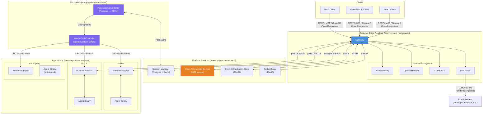
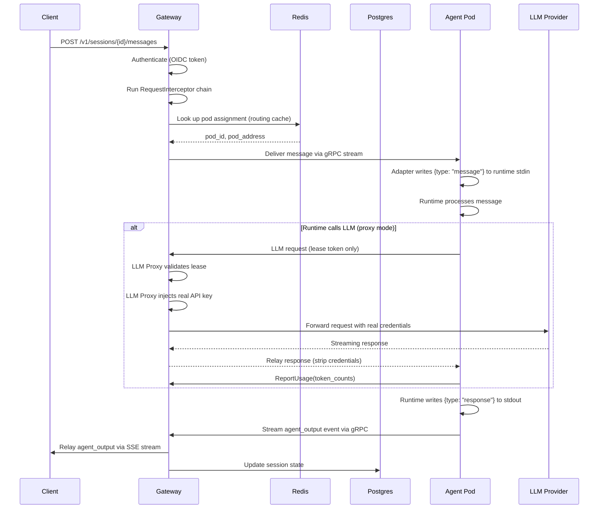
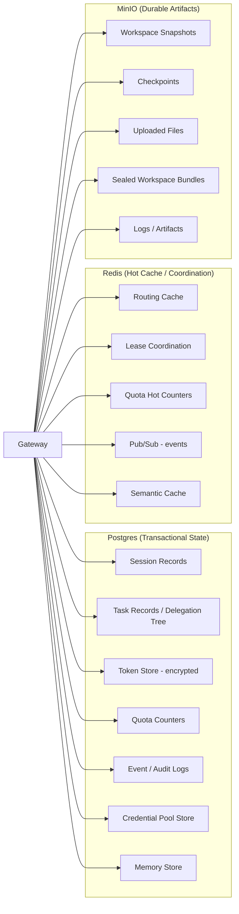
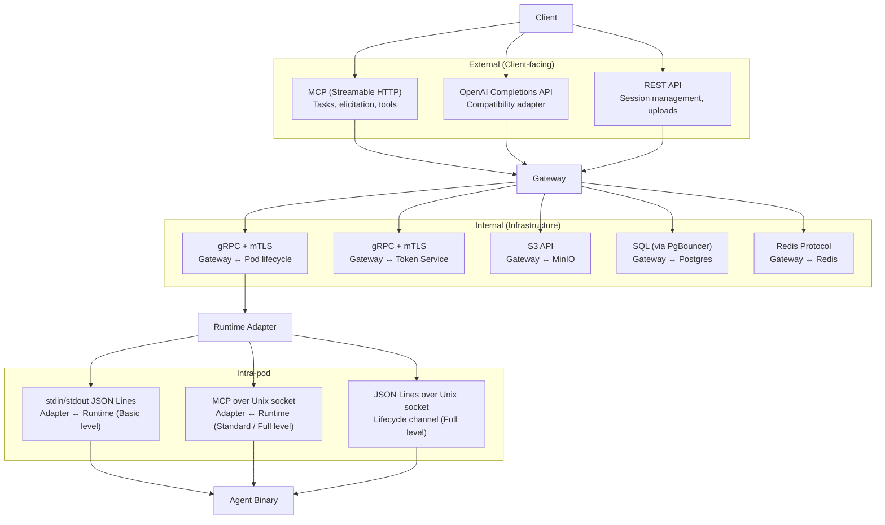
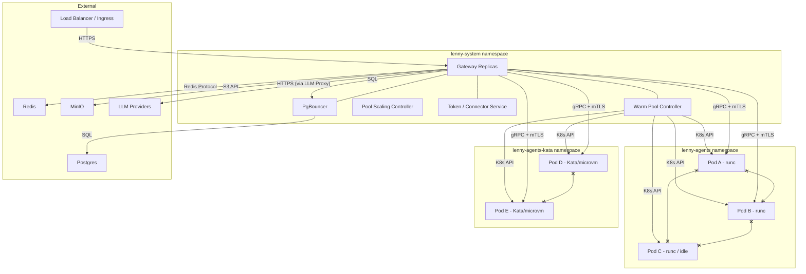

# Architecture Overview
{: .no_toc }

This page explains how Lenny is built: what the major components are, how a client request flows through them to an agent, where data is stored, and where the trust boundaries sit.

  
Table of contents

  {: .text-delta }
- TOC
{:toc}

---

## High-level architecture

---

## Component descriptions

### Gateway Edge Replicas

The gateway is the only externally-facing component. All client interaction enters through stateless gateway replicas deployed behind an ingress controller or load balancer.

**Authentication and authorization.** The gateway authenticates clients via OIDC/OAuth 2.1: it delegates log-in to your identity provider and accepts the bearer tokens it issues. In multi-tenant deployments, the tenant identity is extracted from a configurable identity-provider claim (`auth.tenantIdClaim`, default: `tenant_id`). Authorization decisions (which runtimes, pools, and connectors a user can access) are evaluated against the tenant's role mappings and the `RequestInterceptor` policy chain.

**External interfaces.** The gateway serves a native REST API (`/v1/sessions`, `/v1/admin`) and plugs in additional protocol adapters alongside it:

- **REST API:** The native session and admin API for direct HTTP clients.
- **MCP (Streamable HTTP):** The main client protocol. Sessions appear as MCP Tasks.
- **OpenAI Completions:** Compatibility adapter for OpenAI SDK clients.
- **Open Responses:** Compatibility adapter for the Open Responses protocol.

All interfaces share the same internal session manager. Adding a new external protocol means implementing a new adapter, not modifying the core.

**Session routing.** The gateway maintains a hot routing cache (Redis-backed) that maps `session_id` to the pod currently serving that session. On each request, the gateway looks up the session's pod assignment and proxies the request to the correct pod. Because this is a cache (not the source of truth), any gateway replica can serve any session by falling back to Postgres if the cache is empty.

**Policy engine.** The `RequestInterceptor` chain runs on every request, evaluating a pipeline of interceptors in priority order:

- Content filtering and input validation
- Rate limiting and quota enforcement
- Experiment routing (A/B variant assignment)
- Delegation policy enforcement
- Audit event emission

Interceptors can block requests, modify them, or annotate them with metadata. Deployers can register custom interceptors.

#### Stream Proxy subsystem

Manages long-lived bidirectional connections between clients and agent pods. When a client attaches to a session, the Stream Proxy establishes a gRPC bidirectional stream to the pod's runtime adapter and relays events in both directions. Responsibilities:

- **Session attachment and reattachment.** Clients can disconnect and reconnect to a running session. The Stream Proxy maintains a per-session event buffer so reconnecting clients receive events they missed.
- **Event relay.** Agent output (text, tool calls, tool results, elicitation requests, status changes) flows from the pod through the Stream Proxy to the client.
- **Reconnection handling.** If the client's connection drops, the session continues running on the pod. The client can reattach and resume from where it left off using a cursor-based event replay.

The Stream Proxy has its own goroutine pool and concurrency limits. A slow client cannot block the gateway's ability to handle other sessions.

#### Upload Handler subsystem

Processes all file uploads from clients to pod workspaces. Uploads are streamed through the gateway (never directly to pods) to enforce tenant isolation and audit logging. Responsibilities:

- **Payload validation.** Size limits, file type restrictions, and archive format validation.
- **Staging.** Files are streamed to the pod's staging area and, for durable storage, to the Artifact Store (MinIO).
- **Archive extraction.** tar.gz and zip archives can be extracted during upload.
- **Circuit breaker.** The Upload Handler has its own circuit breaker. If MinIO is degraded, uploads fail gracefully with 503 while the Stream Proxy and MCP Fabric continue operating normally.

#### MCP Fabric subsystem

Orchestrates recursive delegation and manages the virtual MCP interfaces that parent agents use to communicate with child agents. Responsibilities:

- **Virtual child interfaces.** When agent A delegates to agent B, the MCP Fabric creates a virtual MCP server that A interacts with. Agent A sees an MCP interface (task status, results, elicitation forwarding, cancellation) without knowing anything about the underlying pod.
- **Elicitation chain management.** Elicitations flow hop-by-hop through the delegation tree. The MCP Fabric routes each elicitation to the correct parent, tracks pending responses, and applies timeout and suppression policies.
- **Task tree management.** The MCP Fabric maintains the delegation tree structure, tracks node states, and handles completed-subtree offloading to Postgres.

#### LLM Proxy subsystem

The gateway talks to LLM providers on behalf of agent pods so that pods never hold the actual API keys. The pod makes its call against the gateway using only a lease token, and the gateway rewrites the request with the real credentials before forwarding it.

The pod can speak either an OpenAI-style or an Anthropic-style request (whichever matches its runtime). The gateway translates between that and the upstream provider's wire format directly -- Anthropic, AWS Bedrock, Google Vertex AI, and Azure OpenAI are handled inside the gateway itself, without any extra container or network hop. Here's what happens on each call:

1. The pod sends the request to the gateway's LLM proxy at either `/v1/chat/completions` (OpenAI-style) or `/v1/messages` (Anthropic-style), carrying only a lease token.
2. The gateway validates the lease token against the session's active credential lease, runs any configured policies, and accounts the request against the tenant's quota.
3. The gateway rewrites the request into the upstream provider's format, attaches the real credentials from its in-memory cache, and forwards it over TLS.
4. The provider's response comes back, gets translated into the pod's style, token usage is extracted from authoritative fields, post-response policies run, and the response is relayed to the pod.

Consequences:

- **Pods never see API keys.** Only lease tokens.
- **API keys never leave the gateway's memory.** They aren't written to disk, tmpfs, or any other container, so credential rotation is zero-downtime: refresh the cache and the next outbound call picks up the new key.

The proxy tracks active upstream connections per replica and has its own circuit breaker for provider-level outages. Operators who want a broader provider catalog, custom routing, or shared spend accounting can put an external LLM routing proxy (LiteLLM, Portkey, and the like) in front of the gateway's outbound path -- see [External LLM proxy](../operator-guide/external-llm-proxy.md).

---

### Session Manager

The Session Manager is the source of truth for all session and task metadata. It is backed by **Postgres** (primary durable store) and **Redis** (hot routing cache, ephemeral coordination).

**What it manages:**

- **Session records:** ID, tenant ID, user ID, current state, assigned pool, pod binding, working directory, recovery generation, coordination generation.
- **Task records:** The full delegation tree, parent-child lineage, task states, and pending results.
- **Retry state:** Retry counters, policy enforcement, and resume eligibility windows.
- **Pod-to-session binding:** Which session is running on which pod.
- **Delegation lease tracking:** Budget counters, depth limits, and fan-out accounting for the delegation tree.

**Multi-tenancy enforcement:** Every tenant-scoped table carries a `tenant_id` column with PostgreSQL row-level security (RLS), a database feature that filters rows automatically based on a session variable. The gateway sets `SET LOCAL app.current_tenant = '<tenant_id>'` in every transaction, and the RLS policy filters rows accordingly. A defense-in-depth trigger (`lenny_tenant_guard`) rejects queries that reach the database without a tenant context set.

---

### Token / Connector Service

A **separate process** (Kubernetes Deployment) that manages two categories of credentials:

1. **Connector credentials:** OAuth tokens for external tools and agents (GitHub, Jira, Slack, etc.) accessed via registered connectors.
2. **LLM provider credentials:** API keys, IAM roles, and service accounts for LLM providers (managed via Credential Pools).

The Token Service is the only component with KMS decrypt permissions. It holds the envelope encryption keys for stored refresh tokens and can mint short-lived access tokens on demand. Gateway replicas communicate with the Token Service over mTLS; they receive short-lived tokens, never refresh tokens or KMS master keys.

Externally, every token issuance -- initial tokens, rotation, delegation child-token minting, scoped operator tokens -- flows through the canonical [`POST /v1/oauth/token`](../api/admin.md) endpoint using the RFC 8693 grant type `urn:ietf:params:oauth:grant-type:token-exchange`. Delegation child tokens are minted with the parent session token in the `actor_token` field to preserve the chain of custody.

**High availability:** Deployed as a multi-replica Deployment (2+ replicas) with a PodDisruptionBudget. The service is stateless; all persistent state lives in Postgres and KMS. Sessions that already hold credential leases continue operating during Token Service outages; only new sessions that require credentials are affected.

---

### Event / Checkpoint Store

Provides session recovery and observability capabilities, backed by **MinIO** (S3-compatible object storage).

**What it stores:**

- **Workspace checkpoint snapshots:** Periodic tars of `/workspace/current` that enable session recovery after pod failure.
- **Session file snapshots:** Copies of `/sessions/` contents at checkpoint time.
- **Checkpoint metadata:** Generation counters, timestamps, and pod state at checkpoint time.
- **Session logs and runtime stderr:** Durable log storage for debugging and audit.
- **Resume metadata:** Information needed to restore a session on a new pod.

**Checkpoint atomicity:** A checkpoint is all-or-nothing. The metadata record in Postgres references both the workspace snapshot and session file snapshot in MinIO. The metadata record is written only after both artifacts are successfully uploaded. If either upload fails, the entire checkpoint is discarded.

**Checkpoint strategies by runtime integration level:**

| Runtime level | Checkpoint method | Consistency |
|-------------|------------------|-------------|
| Full | Cooperative quiescence via lifecycle channel (`checkpoint_request` / `checkpoint_ready` handshake) | Consistent |
| Standard / Basic | Best-effort snapshot without pausing the runtime | Best-effort |

---

### Warm Pool Controller

Manages individual pod lifecycle, state transitions, and health. Built on the **`kubernetes-sigs/agent-sandbox`** project, which provides the CRD-based warm pool management primitives.

**CRD types managed:**

| CRD | Purpose |
|-----|---------|
| `SandboxTemplate` | Declares a pool: runtime, isolation profile, resource class, warm count range, scaling policy |
| `SandboxWarmPool` | Manages warm pod inventory with configurable `minWarm`/`maxWarm` |
| `Sandbox` | Represents a managed agent pod. Status subresource carries the state machine. |
| `SandboxClaim` | Represents an active session-to-pod binding. Created by the gateway on pod claim. |

**Key responsibilities:**

- Maintain warm pod counts between `minWarm` and `maxWarm` per pool.
- Manage pod state transitions via CRD status subresource updates.
- Handle node drains gracefully (checkpoint active sessions before eviction via preStop hook).
- Garbage-collect orphaned pods and claims.
- Track certificate expiry on idle pods and proactively replace expiring pods.
- Manage PodDisruptionBudgets for warm pods.

**Leader election:** Runs as a multi-replica Deployment with Kubernetes Lease-based leader election. During failover (up to 25 seconds on crash), existing sessions continue unaffected; only new pod creation and pool reconciliation pause.

**Pod claiming:** Gateway replicas claim pods directly via the Kubernetes API using `SandboxClaim` resources with optimistic locking (`resourceVersion`-guarded compare-and-swap). This keeps the controller off the claim hot path entirely. A `ValidatingAdmissionWebhook` (`lenny-sandboxclaim-guard`) provides defense-in-depth against double-claims.

---

### Pool Scaling Controller

Manages desired pool configuration, scaling intelligence, and experiment variant pool sizing. Separate from the Warm Pool Controller.

**Key responsibilities:**

- Reconcile pool configuration from Postgres (admin API, the source of truth) into `SandboxTemplate` and `SandboxWarmPool` CRDs.
- Manage scaling decisions: time-of-day schedules, demand-based rules, experiment variant sizing.
- Compute `minWarm` targets using a demand-based formula that accounts for steady-state claim rates, burst patterns, controller failover windows, and pod startup times.
- Adjust base pool sizing when experiment variants divert traffic.

**CRDs become derived state:** The admin API (Postgres) is the source of truth for pool configuration. The Pool Scaling Controller translates admin API state into Kubernetes CRDs that the Warm Pool Controller reconciles. Manual `kubectl edit` of CRD specs is rejected by a validating webhook.

---

### Agent Pods

Each agent pod contains two processes:

**Runtime adapter (sidecar container).** The standardized bridge between the Lenny platform and the agent binary. It:
- Exposes the gRPC/HTTP+mTLS interface that the gateway uses for lifecycle control.
- Writes the adapter manifest (`/run/lenny/adapter-manifest.json`) with MCP server addresses, credential file paths, and configuration.
- Hosts the intra-pod MCP servers (platform tools, per-connector tools) as abstract Unix socket listeners.
- Manages the lifecycle channel (`@lenny-lifecycle`) for runtimes that implement the Full integration level.
- Handles workspace staging, setup command execution, and checkpoint orchestration.

**Agent binary (main container).** The actual agent runtime -- Claude Code, a LangGraph agent, a custom Python script, or any binary that implements the adapter protocol. The agent binary:
- Reads messages from stdin (Basic integration level) or connects to MCP servers and the lifecycle channel (Standard or Full integration level).
- Reads the adapter manifest to discover available tools and credentials.
- Operates on files in `/workspace/current`.
- Writes responses to stdout.

Pods run with strict security settings: non-root user, all capabilities dropped, read-only root filesystem, writable paths limited to tmpfs and workspace volumes. The selected `RuntimeClass` (runc, gVisor, or Kata) determines the container/VM isolation level.

---

## Data flow

The following diagram shows the complete data flow from a client sending a message to receiving the agent's response:

### Request path in detail

1. **Client sends a message** to `POST /v1/sessions/{id}/messages` on any gateway replica.
2. **Authentication:** The gateway validates the client's identity-provider token and extracts the tenant ID.
3. **Policy evaluation:** The `RequestInterceptor` chain runs -- rate limiting, quota checks, content filtering.
4. **Session lookup:** The gateway reads the session's pod assignment from the Redis routing cache (falling back to Postgres if the cache is empty).
5. **Message delivery:** The gateway's Stream Proxy delivers the message to the assigned pod over the established gRPC bidirectional stream.
6. **Runtime processing:** The adapter writes the message to the runtime's stdin. The runtime processes it, potentially calling tools, delegating to other agents, or requesting human input.
7. **LLM calls (if needed):** The runtime's LLM requests flow through the gateway's LLM Proxy, which injects credentials and forwards to the upstream provider.
8. **Response streaming:** The runtime writes its response to stdout. The adapter sends it back to the gateway over gRPC. The gateway relays it to the client as SSE events.
9. **State persistence:** The gateway updates the session state in Postgres.

---

## Storage architecture

Lenny uses three storage backends:

### Postgres -- Transactional state

All authoritative, durable state lives in Postgres. This includes session records, task trees, delegation lineage, quota counters, credential pool definitions, audit events, and tenant configuration.

- **Row-Level Security** enforces tenant isolation at the database level.
- **Connection pooling** (PgBouncer or cloud-managed proxy) is required in front of Postgres to prevent connection exhaustion under HPA-scaled gateway replicas.
- **Synchronous replication** with automatic failover (managed service or CloudNativePG operator) for HA.

### Redis -- Hot cache and coordination

Redis provides low-latency reads for data that is accessed on every request, plus coordination primitives for distributed session management.

- **Routing cache:** Maps `session_id` to pod address. Populated lazily, evicted on session end.
- **Lease coordination:** Distributed locks for session-level operations (coordinator election, derive serialization).
- **Quota hot counters:** Token usage and rate limit counters, periodically checkpointed to Postgres.
- **Pub/sub:** Event notifications for session state changes, used by gateway replicas to stay synchronized. Every pub/sub payload is wrapped in a **CloudEvents v1.0.2** envelope with `type` values under `dev.lenny.*` (see [CloudEvents catalog](../reference/cloudevents-catalog.md)). Audit records that cross the EventBus carry an OCSF record as the CloudEvent `data` field (single-envelope model).

Redis is a cache and coordination layer, not a source of truth. All Redis state can be reconstructed from Postgres if Redis is restarted.

### MinIO -- Durable artifacts

MinIO (S3-compatible) stores all binary artifacts: uploaded files, workspace snapshots, checkpoint tars, sealed workspace bundles, and large logs.

- **Tenant isolation:** All object paths are prefixed with `/{tenant_id}/`. The `ArtifactStore` interface validates this prefix on every operation.
- **Retention policy:** Artifacts are retained for a configurable TTL (default: 7 days). A background GC job deletes expired artifacts.
- **Local development:** Replaced by the local filesystem (`./lenny-data/`) in `make run` dev mode.

---

## Internal vs external protocols

Lenny uses different protocols for different boundaries:

**Why the split?** MCP covers task-oriented interactions: creating tasks, requesting input, discovering tools, forwarding elicitations. These map to client-facing and agent-to-agent communication. Lifecycle operations (start a pod, upload files, take a checkpoint, rotate credentials) are infrastructure plumbing that does not benefit from MCP's semantics. Using custom gRPC for infrastructure keeps the adapter protocol simple.

---

## Security boundaries

Lenny enforces strict security boundaries between namespaces, with the gateway as the sole bridge:

### Namespace isolation rules

**`lenny-system` namespace** contains all platform components: gateway replicas, controllers, Token Service, PgBouncer. These components have the Kubernetes role-based access control (RBAC) permissions needed to manage pods, CRDs, and secrets.

**`lenny-agents` namespace** contains agent pods running with standard container isolation (runc) or gVisor sandbox. NetworkPolicies enforce:

- **Default-deny all:** No ingress or egress by default.
- **Allow gateway ingress:** Only the gateway (identified by namespace + pod label selector) can connect to pods, on the adapter's gRPC port only.
- **Allow pod-to-gateway egress:** Pods can reach the gateway for the gRPC control channel and (if configured) the LLM Proxy.
- **Allow DNS:** Pods can resolve DNS via the cluster DNS service.
- **No pod-to-pod communication:** Pods cannot communicate with each other. All inter-agent communication goes through the gateway's MCP Fabric via delegation.

**`lenny-agents-kata` namespace** contains agent pods running with Kata Containers (microVM isolation). The same NetworkPolicy rules apply, but pods run inside lightweight VMs for an additional layer of isolation.

### Pod security settings

Every agent pod runs with:

| Control | Setting |
|---------|---------|
| User | Non-root (specific UID/GID) |
| Capabilities | All dropped |
| Root filesystem | Read-only |
| Writable paths | tmpfs (`/tmp`), workspace volumes, sessions directory, artifacts directory |
| Egress | Default-deny NetworkPolicy; allow only gateway + DNS |
| Credentials | No standing credentials; projected ServiceAccount token + short-lived credential lease only |
| File delivery | Gateway-mediated only; no shared storage mounts |
| Adapter-agent auth | `SO_PEERCRED` UID check + manifest nonce (primary); nonce + HMAC challenge-response (fallback under gVisor) |

### What pods can and cannot do

| Pods CAN | Pods CANNOT |
|----------|-------------|
| Read/write files in `/workspace/current` | Access the Kubernetes API server |
| Call LLM providers through the gateway's LLM Proxy | Hold long-lived API keys or secrets |
| Use MCP tools via the adapter's local MCP servers | Communicate with other pods |
| Respond to gateway lifecycle RPCs | Access MinIO, Postgres, or Redis directly |
| Report usage metrics to the gateway | Mount shared storage from other pods |
| Request human input via elicitation chain | Open arbitrary network connections (unless egress profile allows) |
