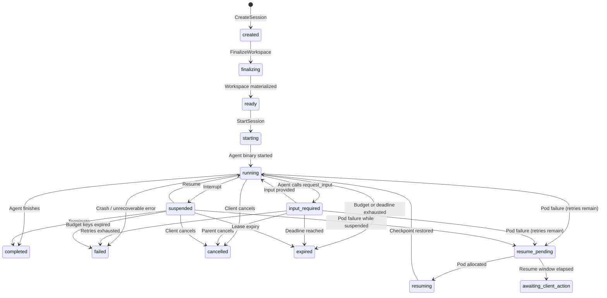
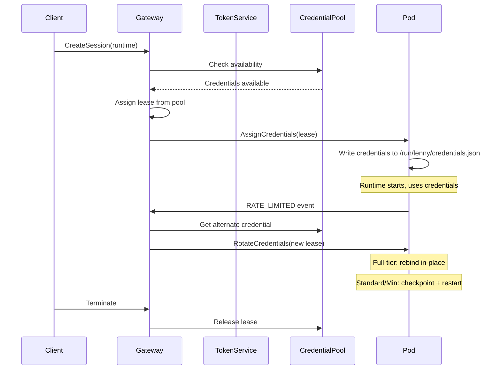

# Core Concepts
{: .no_toc }

This page explains the foundational concepts that underpin Lenny. Each concept is covered in depth -- what it is, how it works, and why it is designed the way it is.

<details open markdown="block">
  <summary>Table of contents</summary>
  {: .text-delta }
- TOC
{:toc}
</details>

---

## Sessions

A **session** is the fundamental unit of work in Lenny. It represents a single interactive engagement between a client and an agent runtime running inside an isolated pod. Sessions are created, progress through a defined state machine, and eventually reach a terminal state.

### Session lifecycle

Every session progresses through a series of states. The state machine is strict -- only specific transitions are allowed, and the gateway enforces them.



### What happens at each state

**created** -- The gateway has authenticated the client, evaluated policy, checked credential availability, claimed an idle warm pod from the pool, persisted the session record, assigned credential leases, and returned a `session_id` with an upload token to the client. The pod is reserved for this session but the agent binary has not started. The client can now upload workspace files. If the session remains in `created` beyond `maxCreatedStateTimeoutSeconds` (default: 300s), it is automatically failed.

**finalizing** -- The client has called `FinalizeWorkspace`. The gateway instructs the pod's adapter to validate the staging area and atomically move files from `/workspace/staging` to `/workspace/current`. Any setup commands defined on the runtime (such as `npm ci` or `pip install`) execute during this phase, bounded by `setupPolicy.timeoutSeconds`.

**ready** -- Workspace materialization and setup commands have completed successfully. The session is ready for the agent binary to start.

**starting** -- The gateway has called `StartSession` on the adapter. The adapter is spawning the runtime binary with the finalized workspace as its working directory.

**running** -- The agent binary is active and processing messages. The client can send messages, and the agent produces streaming output. This is the primary interactive state.

**input_required** -- A sub-state of `running`. The agent has called `lenny/request_input` to request clarification or additional information from its parent or the client. The pod is live, the runtime process is active, but the agent is blocked waiting for a response. The `maxIdleTime` timer is paused during this state, replaced by a separate `maxRequestInputWaitSeconds` timeout. All failure transitions that apply to `running` also apply to `input_required`.

**suspended** -- The session has been interrupted (by the client, by an interrupt signal, or by the agent itself). The pod is still held for a configurable duration (`maxSuspendedPodHoldSeconds`), allowing a fast resume without re-claiming a pod. If the hold duration elapses, the pod is released and a resume transitions through `resume_pending`.

**resume_pending** -- The session needs to resume but does not currently have a pod. This happens after a pod crash (when retries remain) or after a suspended session's pod hold expires. The gateway attempts to claim a new warm pod and restore the session from the last checkpoint.

**resuming** -- A new pod has been claimed and the session is being restored from a checkpoint. The workspace snapshot is materialized on the new pod, and the agent binary is restarted from the checkpointed state.

**awaiting_client_action** -- The resume window (`maxResumeWindowSeconds`) has elapsed without a pod becoming available. The session is waiting for the client to take action (retry, cancel, or wait longer).

**completed** -- The agent has finished its work normally. The workspace has been sealed (exported to durable storage). This is a terminal state.

**failed** -- The session encountered an unrecoverable error: the runtime crashed and retries were exhausted, an internal error occurred, or all credential keys expired. This is a terminal state.

**cancelled** -- The client or a parent session explicitly cancelled the session. This is a terminal state.

**expired** -- A time-based limit was reached: the delegation lease's `perChildMaxAge`, a token budget, or a session deadline. This is a terminal state.

### Resume semantics

When a session is resumed (after pod failure or suspended pod release), the gateway:

1. Claims a new warm pod from the pool.
2. Materializes the workspace from the last successful checkpoint snapshot.
3. Restarts the agent binary via the `Resume` RPC with the checkpointed session state.
4. Emits a `session.resumed` event to the client with `resumeMode` (either `full` for a normal checkpoint restore, or `conversation_only` if only the minimal eviction state was preserved) and `workspaceLost` (boolean indicating whether workspace files were lost).
5. Increments `recovery_generation` on the session record. Clients can observe this counter to track how many times a session has been recovered.

The `recovery_generation` counter tracks pod recoveries. A separate `coordination_generation` counter tracks gateway replica handoffs (when a different gateway replica takes over as session coordinator). These are independent -- a coordinator handoff does not increment `recovery_generation`, and a pod recovery does not reset `coordination_generation`.

---

## Runtimes

A **runtime** defines a type of agent that can run on Lenny. It specifies the container image, execution mode, isolation profile, capabilities, and resource constraints for a class of agent sessions.

### Runtime-agnostic contract

Lenny does not know or care what language your agent is written in or what LLM provider it calls. It defines a standard contract -- the **runtime adapter protocol** -- that any compliant binary can implement. The adapter protocol has two sides:

- **Gateway to adapter:** gRPC/HTTP+mTLS RPCs for lifecycle operations (`PrepareWorkspace`, `FinalizeWorkspace`, `StartSession`, `Checkpoint`, `Terminate`, etc.).
- **Adapter to runtime binary:** A simple stdin/stdout JSON Lines protocol at the minimum tier, with optional MCP server connections and a lifecycle channel at higher tiers.

### Runtime types

**`type: agent`** -- The primary runtime type. Participates in Lenny's full task lifecycle: receives messages via stdin, produces responses, can delegate to other agents, request human input via elicitation, access MCP tools, and manage multi-turn interactive sessions.

**`type: mcp`** -- Hosts an MCP server. Lenny manages the pod lifecycle (isolation, credentials, workspace, pool management, egress control, audit) but does not impose its own task lifecycle. The runtime binary is oblivious to Lenny -- it simply runs an MCP server, and Lenny exposes it at a dedicated gateway endpoint (`/mcp/runtimes/{name}`). Useful for hosting tool servers, code interpreters, or specialized services that external clients connect to directly.

### Integration tiers

To lower the barrier for third-party runtime authors, Lenny defines three integration tiers for `type: agent` runtimes. Each tier adds capabilities on top of the previous one.

#### Minimum tier

The floor -- enough to get a custom runtime working with zero Lenny-specific knowledge:

- **Protocol:** stdin/stdout JSON Lines only.
- **Input:** Reads `{type: "message"}` objects from stdin.
- **Output:** Writes `{type: "response"}` and `{type: "tool_call"}` objects to stdout.
- **Heartbeat:** Must respond to `{type: "heartbeat"}` with `{type: "heartbeat_ack"}` within 10 seconds, or receive SIGTERM.
- **Shutdown:** Must handle `{type: "shutdown"}` by exiting within the specified `deadline_ms`.
- **No MCP integration, no checkpointing, no lifecycle channel.**
- **Credential rotation:** If the credential needs to change mid-session, the gateway checkpoints and restarts the session on a new pod (Standard-tier rotation path). Minimum-tier runtimes that do not support checkpointing lose in-flight context.

#### Standard tier

Minimum tier plus MCP integration:

- Reads the adapter manifest at `/run/lenny/adapter-manifest.json` to discover available MCP servers.
- Connects to the adapter's **platform MCP server** (abstract Unix socket) for delegation, discovery, output parts, elicitation, and memory tools.
- Connects to **per-connector MCP servers** for external tool access (GitHub, Jira, etc.).
- Uses standard MCP client libraries -- no Lenny-specific code beyond reading the manifest and presenting a nonce during the MCP `initialize` handshake.
- **Credential rotation:** Same as Minimum -- checkpoint and restart.

**Note:** Standard and Full tier runtimes require abstract Unix sockets, which are a Linux-only feature. macOS developers should use `docker compose up` (Tier 2 dev mode) for Standard/Full tier development.

#### Full tier

Standard tier plus the lifecycle channel:

- Opens a bidirectional JSON Lines stream over an abstract Unix socket (`@lenny-lifecycle`) for operational signals.
- Supports cooperative checkpoint/restore: the adapter sends `checkpoint_request`, the runtime quiesces and replies `checkpoint_ready`, snapshots are captured, and the adapter sends `checkpoint_complete`.
- True session continuity across pod failures with consistent checkpoints.
- Clean interrupt handling via `interrupt_request` / `interrupt_acknowledged` signals.
- **Mid-session credential rotation without restart:** The adapter sends `credentials_rotated` on the lifecycle channel, the runtime rebinds its LLM provider in-place, and replies `credentials_acknowledged`. No session interruption.
- Graceful shutdown coordination via `DRAINING` state.

### Execution modes

Each runtime is configured with an **execution mode** that determines how pods are used:

**`session`** -- One session per pod. After the session completes, the pod is terminated and replaced. This prevents cross-session data leakage through residual workspace files, cached DNS, or runtime memory. This is the default and the most secure mode.

**`task`** -- Pods are reused across sequential tasks with workspace scrubbing between tasks. A fresh credential lease is assigned per task. The workspace is cleaned (`kill -9 -1` as sandbox user, workspace directory removal, scratch cleanup, `/tmp` flush) between tasks. Deployers must explicitly acknowledge the residual state risk.

**`concurrent`** -- Multiple simultaneous tasks on a single pod, multiplexed via slot IDs. Each slot gets its own workspace directory (`/workspace/slots/{slotId}/current/`) and independent credential lease. Useful for high-throughput, stateless or semi-stateless workloads.

---

## Pools

A **pool** is a group of pre-warmed pods that are ready to serve sessions for a specific runtime. Pools are the mechanism by which Lenny achieves low startup latency -- pods are warm before requests arrive, so the only hot-path work is workspace materialization.

### Pre-warming strategy

Each pool maintains a configurable number of warm pods between `minWarm` and `maxWarm`. A warm pod is:

- Scheduled and running on a Kubernetes node.
- Using the selected `RuntimeClass` (runc, gVisor, or Kata).
- Runtime adapter listening and health-checked.
- Agent binary dependencies installed and loaded.
- Workspace directories present but empty.
- Marked "idle and claimable" via a readiness gate.
- **No** user session bound. **No** client files present. **No** LLM credentials assigned.

When a client creates a session, the gateway claims one of these idle pods from the pool. The pod transitions from `idle` to `claimed`, and workspace setup begins. Because the pod is already running, the client does not wait for container image pulls, runtime startup, or dependency installation.

### Pool-level configuration

Pools are configured with:

- **Runtime reference:** Which runtime definition this pool serves.
- **Resource class:** CPU, memory, and storage resource allocations (e.g., `small`, `medium`, `large`).
- **Isolation profile:** `runc` (standard container), `gvisor` (gVisor sandbox), or `microvm` (Kata Containers / Firecracker). Determines the `RuntimeClass` applied to pods.
- **Warm count range:** `minWarm` and `maxWarm` bounds for the number of idle pods.
- **Scaling policy:** Optional time-of-day schedules (e.g., scale to zero overnight), demand-based rules, and safety factors.
- **Egress profile:** Network policy applied to pods (`restricted`, `internet`, or custom).
- **Setup command policy:** Allowlisted commands that may run during workspace finalization.

### SDK-warm pools

Runtimes that declare `capabilities.preConnect: true` can have their SDK process pre-connected during the warm phase. All pods in such a pool are **SDK-warm**: the agent process is started and waiting for its first prompt before any session is assigned. This eliminates SDK cold-start latency from the hot path.

If the incoming session's workspace includes files that must be present at SDK startup (configured via `sdkWarmBlockingPaths`, defaulting to `CLAUDE.md` and `.claude/*`), the gateway demotes the pod back to pod-warm state by tearing down and restarting the SDK process before proceeding with the normal workspace setup. A circuit breaker automatically disables SDK-warm mode for a pool if the demotion rate exceeds 90%.

### Scale-to-zero

Pools support `minWarm: 0` via time-of-day schedules:

```yaml
scalePolicy:
  scaleToZero:
    schedule: "0 22 * * *"     # Scale to zero at 10 PM
    resumeAt: "0 6 * * *"      # Resume warming at 6 AM
    timezone: "America/New_York"
```

Sessions arriving during zero-warm periods incur cold-start latency (a pod must be created from scratch). This is disabled by default for `type: mcp` pools to avoid latency spikes on tool server connections.

---

## Gateway

The **gateway** is the only externally-facing component in Lenny. All client interaction enters and exits through gateway edge replicas. Pods are internal workers that are never directly exposed to clients.

### Why gateway-centric?

The gateway-centric design provides several critical guarantees:

- **Security boundary:** Clients never see pod addresses, internal endpoints, or raw credentials. The gateway authenticates, authorizes, and mediates every interaction.
- **Session portability:** Because session state is externalized (Postgres, Redis, MinIO), a client can land on any gateway replica. Pod failure triggers a transparent resume on a different pod with no client-side routing changes.
- **Policy enforcement:** Rate limiting, token budgets, concurrency controls, content filtering, and audit logging all run in the gateway, not in the (untrusted) agent pod.
- **Protocol translation:** The gateway translates between external protocols (REST, MCP, OpenAI Completions, Open Responses) and Lenny's internal adapter protocol. Runtimes do not need to implement any external protocol.

### Stateless replicas

Gateway replicas are stateless -- they can be scaled horizontally behind a load balancer with HPA. Sticky routing is an optimization (avoids re-reading session state from Postgres on every request) but is not a correctness requirement. Any replica can serve any session.

### Internal subsystems

The gateway binary is internally partitioned into four subsystem boundaries. These are Go interfaces within a single binary, not separate services, but they enforce isolation at the concurrency and failure-domain level:

**Stream Proxy** -- Handles MCP streaming, session attachment, event relay, and client reconnection. This is the subsystem that maintains the long-lived bidirectional connection between the client and the agent. Each stream has its own goroutine; a slow stream cannot block others.

**Upload Handler** -- Manages file upload proxying, payload validation, staging to the Artifact Store, and archive extraction. Upload processing is CPU- and I/O-intensive (decompression, virus scanning); isolating it prevents upload bursts from starving streaming connections.

**MCP Fabric** -- Orchestrates recursive delegation, maintains virtual child MCP interfaces, and manages elicitation chain forwarding. When an agent delegates to another agent, the MCP Fabric creates a virtual MCP server that the parent interacts with, while the actual child session runs in a separate pod.

**LLM Proxy** -- A credential-injecting reverse proxy for LLM provider traffic. When a pod needs to call an LLM, the request passes through this proxy, which validates the credential lease, injects the real API key, and forwards the request to the upstream provider. Pods never hold actual API keys.

Each subsystem has its own goroutine pool, concurrency limits, metrics, and circuit breaker. A saturated Upload Handler cannot consume goroutines needed by the Stream Proxy. If the LLM Proxy's upstream connections stall, the Stream Proxy and MCP Fabric continue serving normally.

---

## Delegation

**Recursive delegation** is a platform primitive in Lenny, not a hardcoded orchestration pattern. Any agent running on the platform can delegate work to other agents through the gateway. The gateway provides the foundational operations; the agent binary decides whether and how to use them.

### How delegation works

When a parent agent wants to delegate work, it calls the `lenny/delegate_task` tool on the platform MCP server:

```
lenny/delegate_task(
  target: "code-review-agent",
  task: {
    input: [{ type: "text", text: "Review the auth module" }],
    workspaceFiles: {
      export: [{ glob: "src/auth/**", destPrefix: "/" }]
    }
  },
  lease_slice: {
    maxTokenBudget: 50000,
    maxChildrenTotal: 3,
    perChildMaxAge: 1800
  }
)
```

The delegation flow:

1. The parent agent calls `lenny/delegate_task` with a target runtime name, task specification, and optional budget slice.
2. The gateway validates the delegation against the parent's effective delegation policy and remaining budget (depth limits, fan-out limits, allowed runtimes, token budgets).
3. The gateway performs **cycle detection**: it checks the full runtime lineage from root to current node. If the target runtime already appears in the lineage, the delegation is rejected with `DELEGATION_CYCLE_DETECTED`. This prevents circular wait deadlocks.
4. The gateway exports the requested files from the parent's workspace and stores them durably.
5. The gateway allocates a child pod from the target runtime's pool.
6. The exported files are streamed into the child pod, rebased to the child's workspace root.
7. The child starts with its own isolated workspace containing only the exported files.
8. The gateway creates a **virtual MCP child interface** and injects it into the parent.
9. The parent interacts with the child through this virtual interface (status, results, elicitation forwarding, cancellation).

### Scope narrowing

Delegation enforces strict scope narrowing. A child can never have more permissions, budget, or reach than its parent:

- **Token budgets** are sliced from the parent's remaining budget. A child cannot exceed what the parent allocated.
- **Delegation depth** is bounded by `maxDelegationDepth`. Each level of delegation decrements the remaining depth.
- **Fan-out** is controlled by `maxParallelChildren` (concurrent children) and `maxChildrenTotal` (lifetime children).
- **Tree size** is bounded by `maxTreeSize`, which caps the total number of pods in the delegation tree.
- **Allowed runtimes** are filtered by the delegation policy -- a child can only delegate to runtimes explicitly permitted by policy.

### Lineage tracking

Every delegation creates a node in a **task tree**. The gateway tracks the full parent-child lineage, including session IDs, runtime identities, states, and pending results. Agents can query the tree via `lenny/get_task_tree` to understand the structure of their delegation hierarchy.

When a parent pod fails and resumes, the gateway reconstructs all active virtual child interfaces from the task tree stored in Postgres. The parent receives a `children_reattached` event with the current state of each child (running, completed, failed, `input_required`), along with any pending results or elicitations.

### Task trees

A delegation tree can grow to significant depth and breadth. The gateway manages memory carefully:

- Per-node in-memory footprint is approximately 12 KB (virtual child interface, event buffer, elicitation state, task metadata).
- A 50-node tree uses approximately 600 KB.
- `maxTreeMemoryBytes` (default: 2 MB) caps the aggregate in-memory footprint per tree.
- Completed subtrees are offloaded to Postgres and replaced with lightweight stubs, keeping memory bounded for long-running trees.

---

## Workspaces

A **workspace** is the pod-local filesystem area where an agent operates. Lenny follows a strict principle: **pod-local workspace, gateway-owned state**. The pod's disk is a cache; the authoritative session state lives in durable stores (Postgres, MinIO).

### Workspace lifecycle

**Staging:** When a client uploads files, they are streamed through the gateway into the pod's staging area (`/workspace/staging`). Files are staged but not yet visible to the runtime.

**Materialization:** When the client calls `FinalizeWorkspace`, the staging area is validated and atomically moved to `/workspace/current`. Setup commands (if any) execute at this point. The workspace is now the runtime's working directory.

**Runtime operation:** The agent reads and writes files in `/workspace/current` during its session. All filesystem access is local to the pod -- no shared NFS mounts, no distributed filesystem.

**Checkpointing:** The gateway periodically snapshots the workspace (tar of `/workspace/current`) and uploads it to MinIO as a checkpoint. Full-tier runtimes participate in cooperative quiescence (the adapter pauses the runtime during snapshot). Minimum/Standard-tier runtimes get best-effort snapshots without pausing.

**Sealing:** When the session completes, the workspace is exported to durable storage as a sealed, immutable snapshot. This snapshot is the session's final artifact and can be used to derive new sessions.

### Gateway-mediated file delivery

Files enter and exit pods exclusively through the gateway. There are no shared volume mounts, no direct object store access from pods, and no git-based workspace population. This design enforces:

- **Least privilege:** Pods have no credentials to access the artifact store directly.
- **Tenant isolation:** The gateway validates tenant ownership on every file operation.
- **Audit trail:** Every file upload and download is logged through the gateway.
- **Portability:** Workspace delivery works identically regardless of the underlying storage backend.

### Checkpointing and recovery

Checkpoints are the mechanism by which Lenny survives pod failures. A checkpoint is an atomic unit comprising:

- A workspace snapshot (tar of `/workspace/current`).
- A session file snapshot (copy of `/sessions/` contents).
- Checkpoint metadata (generation, timestamp, pod state).

If either snapshot fails, the entire checkpoint is discarded -- partial checkpoints are never stored. Periodic checkpoints run at a configurable interval (default: 600 seconds), with jitter to prevent thundering-herd storms across sessions.

When a pod fails, the gateway claims a new pod and restores the workspace from the last successful checkpoint. The `recovery_generation` counter is incremented so the client knows how many recoveries have occurred.

---

## MCP (Model Context Protocol)

Lenny uses MCP as the primary protocol for client-facing interaction and agent-to-agent communication, but it is deliberately **not** used for infrastructure plumbing.

### Where MCP is used

| Boundary | Protocol | Why |
|----------|----------|-----|
| Client to gateway | MCP (Streamable HTTP) | Tasks, elicitation, auth discovery, tool surface |
| Adapter to runtime (intra-pod) | MCP (local Unix socket servers) | Platform tools, per-connector tool servers |
| Parent pod to child (via gateway) | MCP (virtual interface) | Delegation, tasks, elicitation forwarding |
| Gateway to external MCP tools | MCP | Tool invocation, OAuth flows |
| Gateway to `type: mcp` runtimes | MCP (dedicated endpoints) | Direct MCP server access |

### Where MCP is not used

| Boundary | Protocol | Why |
|----------|----------|-----|
| Gateway to pod (lifecycle control) | Custom gRPC/HTTP+mTLS | Lifecycle operations (workspace setup, checkpointing, credential assignment, session start/stop) are infrastructure plumbing that does not map to MCP's task-oriented semantics. Using a custom protocol keeps the adapter contract simple and avoids forcing MCP into roles it was not designed for. |

### MCP Tasks

Lenny surfaces sessions as MCP Tasks to external clients. A Task represents a long-running operation with a defined state machine (submitted, working, input_required, completed, failed, cancelled). The gateway translates between Lenny's internal session state machine and the MCP Task state machine.

### Elicitation

MCP Elicitation is the mechanism by which agents request human input during a session. Elicitations flow hop-by-hop through the delegation chain:

```
External Tool → Gateway connector → Child pod → Parent pod → Gateway edge → Client/Human
```

The gateway mediates every hop and tags each elicitation with provenance metadata (originating pod, delegation depth, runtime type, purpose). This allows client UIs to distinguish between platform-initiated OAuth flows and agent-initiated prompts, applying appropriate trust indicators.

Elicitations have configurable timeouts, depth-based suppression rules, and budgets (`maxElicitationsPerSession`) to prevent agents from spamming users.

---

## Tenants

Lenny is designed for **multi-tenancy from day one**, even though most deployments start as single-tenant.

### Multi-tenancy model

Every tenant-scoped record in the system carries a `tenant_id` column: sessions, tasks, tokens, memories, quota counters, credential pools, audit events, and more. The primary isolation mechanism is **PostgreSQL Row-Level Security (RLS)**: every tenant-scoped table has an RLS policy that filters rows based on the database session's `app.current_tenant` setting. Every database call is wrapped in an explicit transaction that begins with `SET LOCAL app.current_tenant = '<tenant_id>'`.

This means that even if application-layer code has a bug and omits a `WHERE tenant_id = ?` clause, the database enforces isolation regardless. A missing WHERE clause cannot break tenant isolation.

### Single-tenant default

For single-tenant deployments, `tenant_id` defaults to a built-in value (`default`). The field is always present internally -- RLS policies and queries always filter by it -- but single-tenant deployers never need to set or think about it. The gateway automatically applies the default tenant.

Multi-tenant mode is enabled by configuring OIDC claims that carry tenant identity. No additional schema changes or migration is required.

### Platform-global vs tenant-scoped resources

Not all resources are tenant-scoped:

| Scoping model | Resources | Isolation mechanism |
|--------------|-----------|-------------------|
| **Tenant-scoped** | Sessions, tasks, tokens, memories, quota counters, credential pools, audit events, delegation policies, connectors, environments, experiments | `tenant_id` column + RLS |
| **Platform-global** | Runtimes, pools, external adapters | No `tenant_id` column. Visibility controlled by access join tables (`runtime_tenant_access`, `pool_tenant_access`) with application-layer filtering. A single runtime or pool can be made available to multiple tenants without data duplication. |

### Namespace isolation

In Kubernetes, agent pods run in dedicated namespaces (`lenny-agents`, `lenny-agents-kata`) separate from the platform components (`lenny-system`). NetworkPolicies enforce a default-deny posture: pods cannot communicate with each other or with the internet unless explicitly allowed. The gateway is the only component allowed to initiate connections to agent pods.

---

## Credentials

Lenny manages two categories of credentials, both following a strict least-privilege model: pods never hold long-lived secrets.

### LLM provider credentials

When a runtime needs to call an LLM (Anthropic, AWS Bedrock, Vertex AI, Azure OpenAI, etc.), it does not hold the API key directly. Instead:

1. **Credential pools** are admin-managed, tenant-scoped sets of credentials for each provider. Deployers register API keys, IAM roles, or service accounts as pool entries.
2. At session creation, the gateway evaluates the `CredentialPolicy` and assigns a **credential lease** -- a short-lived, revocable binding between the session and a specific credential from the pool.
3. The lease is delivered to the pod via the `AssignCredentials` RPC. Depending on the `deliveryMode`:
   - **Proxy mode (default):** The pod receives only a lease token. All LLM traffic flows through the gateway's LLM Proxy subsystem, which injects the real API key. The pod never sees the actual credential.
   - **Direct mode:** The pod receives the actual credential (short-lived STS token, access token, etc.) and calls the LLM provider directly. Used when proxy latency is unacceptable or when the provider requires direct client connections.
4. Leases have a TTL (provider-dependent, e.g., 1 hour for `anthropic_direct`, 15 minutes for `aws_bedrock`). The gateway handles automatic renewal.
5. When a credential is rate-limited, the gateway can fail over to a different credential in the pool, or rotate the credential mid-session (Full-tier runtimes support this without restart).

### MCP tool tokens

When agents access external tools (GitHub, Jira, Slack, etc.) via MCP connectors, the OAuth tokens are managed by the **Connector/Token Service** -- a separate process with its own KMS access. Pods never hold downstream OAuth tokens:

- Refresh tokens are stored encrypted at rest (envelope encryption via KMS).
- Access tokens are short-lived and cached in Redis (encrypted, not plaintext).
- The Token Service is the only component with KMS decrypt permissions.
- Gateway replicas request tokens via the Token Service API over mTLS. They receive short-lived access tokens, never refresh tokens or KMS keys.

### Credential leasing lifecycle



The credential pool supports multiple assignment strategies:

- **`least-loaded`**: Assigns the credential with the fewest active sessions.
- **`round-robin`**: Rotates through credentials sequentially.
- **`sticky-until-failure`**: Reuses the same credential for a user until it is rate-limited or fails.

Each credential has a `maxConcurrentSessions` limit and a configurable `cooldownOnRateLimit` duration. When a credential hits a rate limit, it enters a cooldown period during which it is not assigned to new sessions.
