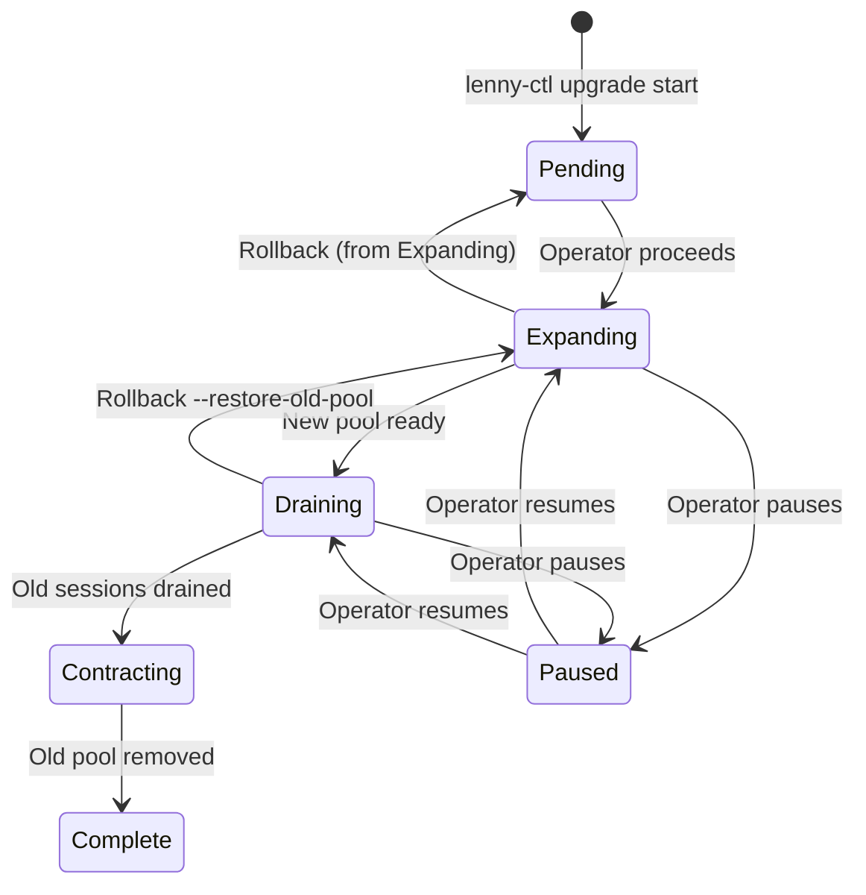

# Upgrades

This page covers gateway rolling upgrades, pool image upgrade state machine, the `lenny-ctl upgrade` workflow, rollback procedures, CRD upgrade requirements, and MCP protocol version deprecation.

---

## Gateway Rolling Upgrades

Gateway replicas are stateless-ish and upgraded via standard Kubernetes rolling deployments:

```bash
helm upgrade lenny lenny/lenny \
  --namespace lenny-system \
  --values values.yaml \
  --wait --timeout 10m
```

### Upgrade Sequence

The Helm upgrade executes in order:

1. **CRDs must be applied first** (see [CRD Upgrades](#crd-upgrades) below)
2. **Preflight Job** validates infrastructure prerequisites
3. **Schema migrations** apply any new Postgres schema changes
4. **Component deployments** roll out gateway, token service, controllers
5. **Bootstrap Job** applies any new seed configuration
6. **CRD validation hook** verifies CRD versions match the chart

### PodDisruptionBudget

The gateway PDB limits simultaneous disruptions during rolling updates. Configure via:

```yaml
gateway:
  pdb:
    minAvailable: 1    # Or use maxUnavailable
```

### CheckpointBarrier During Rolling Updates

During gateway rolling restarts, the controller sends a `CheckpointBarrier` to all active pods before draining sessions from an outgoing replica. This ensures workspace state is checkpointed before coordinator handoff.

Monitor checkpoint barrier outcomes:
- `lenny_checkpoint_barrier_ack_total` (by outcome: success, timeout, error)
- `lenny_checkpoint_barrier_ack_duration_seconds`

---

## Pool Image Upgrades

Runtime image upgrades use a 6-state upgrade machine that provides canary validation and safe rollback at every phase.

### Upgrade State Machine



### State Descriptions

| State | What Happens |
|---|---|
| **Pending** | Upgrade registered; no changes applied yet |
| **Expanding** | New pool created with the new image; old pool continues serving |
| **Draining** | New sessions routed to new pool; old pool drains existing sessions |
| **Contracting** | Old pool pods terminated after all sessions complete |
| **Complete** | Upgrade finalized; old pool CRDs removed |
| **Paused** | Upgrade halted at current state; can resume or rollback |

### Upgrade Workflow

**Step 1: Start the upgrade**

```bash
lenny-ctl admin pools upgrade start \
  --pool claude-worker-sandboxed-small \
  --new-image registry.example.com/claude-runtime:v1.3@sha256:abc123
```

**Step 2: Monitor and proceed through phases**

```bash
# Check upgrade status
lenny-ctl admin pools upgrade status --pool claude-worker-sandboxed-small

# Advance to next phase
lenny-ctl admin pools upgrade proceed --pool claude-worker-sandboxed-small
```

**Step 3: Validate at each phase**

Monitor the following before proceeding:
- `lenny_runtime_upgrade_state` gauge shows current state
- `lenny_runtime_upgrade_draining_sessions` shows remaining sessions on old pool
- `lenny_runtime_upgrade_phase_duration_seconds` shows time in current phase

**Step 4: Complete or rollback**

```bash
# Complete the upgrade (after draining finishes)
lenny-ctl admin pools upgrade proceed --pool claude-worker-sandboxed-small

# Or rollback at any point
lenny-ctl admin pools upgrade rollback --pool claude-worker-sandboxed-small
```

### Pause and Resume

Pause the upgrade at any point to hold the current state:

```bash
# Pause
lenny-ctl admin pools upgrade pause --pool claude-worker-sandboxed-small

# Resume
lenny-ctl admin pools upgrade resume --pool claude-worker-sandboxed-small
```

### Phase Timeout

The `RuntimeUpgradeStuck` warning alert fires when any pool remains in a non-terminal state (`expanding`, `draining`, or `contracting`) for longer than `runtimeUpgrade.phaseTimeoutSeconds` (default: 600s).

---

## Rollback Procedures

### Rollback from Expanding State

From the `Expanding` state, rollback restores full routing to the old pool and removes the new pool:

```bash
lenny-ctl admin pools upgrade rollback --pool claude-worker-sandboxed-small
```

### Rollback from Draining or Contracting State

From `Draining` or `Contracting`, the old pool may still exist. Use `--restore-old-pool` to recreate it:

```bash
lenny-ctl admin pools upgrade rollback \
  --pool claude-worker-sandboxed-small \
  --restore-old-pool
```

This recreates the old pool configuration from `RuntimeUpgrade.previousPoolSpec` and restores routing. Only valid while the old `SandboxTemplate` CRD still exists.

### Helm Rollback

For a full platform rollback:

```bash
# List release history
helm history lenny -n lenny-system

# Rollback to previous revision
helm rollback lenny <previous-revision> -n lenny-system
```

After rollback, apply CRDs for the previous version and restart controllers.

---

## CRD Upgrades

### Critical: CRDs Must Be Applied Before Every Upgrade

Helm does **not** update CRDs on `helm upgrade`. This is a known limitation that causes silent production incidents if CRDs become stale.

### Required Upgrade Sequence

1. **Apply CRDs first:**
   ```bash
   kubectl apply -f https://github.com/lenny-dev/lenny/releases/latest/download/crds.yaml
   ```

2. **Run `helm upgrade`:**
   ```bash
   helm upgrade lenny lenny/lenny \
     --namespace lenny-system \
     --values values.yaml \
     --wait --timeout 10m
   ```

3. **Verify CRD versions:**
   ```bash
   kubectl get crd sandboxtemplates.lenny.dev \
     -o jsonpath='{.metadata.annotations.lenny\.dev/schema-version}'
   ```

### GitOps Workflows

For ArgoCD or Flux, configure CRDs as a separate sync wave:

```yaml
# ArgoCD: sync-wave -5 ensures CRDs apply before the main chart
metadata:
  annotations:
    argocd.argoproj.io/sync-wave: "-5"
```

### Post-Upgrade CRD Validation Hook

The chart includes a `lenny-crd-validate` Job that runs after `helm upgrade` and verifies all CRDs carry the expected `lenny.dev/schema-version`. If any CRD is stale, the Job fails with clear remediation instructions.

### Stale CRD Recovery

If CRDs are stale after an upgrade:

1. Identify the exact chart version: `helm list -n lenny-system`
2. Apply CRDs from the matching release
3. Restart controllers: `kubectl rollout restart deployment -l app.kubernetes.io/part-of=lenny -n lenny-system`
4. Verify: `kubectl get pods -l app.kubernetes.io/part-of=lenny -n lenny-system`
5. If recovery fails, rollback the Helm release

---

## Schema Migrations

### Expand-Contract Discipline

Lenny uses a 3-phase expand-contract migration strategy:

| Phase | Description |
|---|---|
| Phase 1 (Expand) | Add new columns/tables; old code ignores new fields |
| Phase 2 (Deploy) | Deploy code that reads/writes both old and new schema |
| Phase 3 (Contract) | Drop old columns/tables after all data migrated |

### Migration Status

Check migration status at any time:

```bash
lenny-ctl migrate status
```

Output includes:
- `version` -- migration file number
- `phase` -- current phase (`phase1_applied`, `phase2_deployed`, `phase3_applied`, `complete`)
- `appliedAt` -- timestamp
- `gateCheckResult` -- Phase 3 gate (pass/fail)

### Phase 3 Gate

Phase 3 migrations include a gate check that verifies all data has been migrated. Do not deploy Phase 3 until the gate passes:

```bash
# Check if Phase 3 is safe to deploy
lenny-ctl migrate status
# Look for: gateCheckResult=pass
# If gateCheckResult=fail:<N>_rows, un-migrated rows remain -- do not deploy Phase 3
```

---

## MCP Protocol Version Deprecation

### Deprecation Policy

MCP protocol versions follow a deprecation timeline:

1. **Announcement** -- new version released; old version marked deprecated
2. **Migration window** -- both versions supported simultaneously
3. **Removal** -- old version clients receive errors; sessions must upgrade

### Monitoring Deprecated Versions

The metric `lenny_mcp_deprecated_version_active_sessions` tracks sessions still using deprecated protocol versions.

### Pool Draining for Deprecated Versions

When retiring a protocol version:

```bash
# Drain the pool -- new sessions rejected with 503 POOL_DRAINING
lenny-ctl admin pools drain --pool <pool-name>

# Monitor draining progress
kubectl get sandboxes -A -l lenny.dev/pool=<pool-name>
```

---

## Upgrade Checklist

Before any upgrade:

- [ ] Read the release notes for breaking changes
- [ ] Apply CRDs from the target release version
- [ ] Run preflight checks: `lenny-ctl preflight --config values.yaml`
- [ ] Verify PDB is configured for gateway and admission webhooks
- [ ] Monitor `lenny_checkpoint_barrier_ack_total` during rollout
- [ ] For pool image upgrades, use the 6-state upgrade machine (not direct pod replacement)
- [ ] Verify CRD versions match after upgrade: check `lenny.dev/schema-version` annotation
- [ ] Confirm all components are healthy: `kubectl get pods -n lenny-system`
- [ ] Check migration status: `lenny-ctl migrate status`
