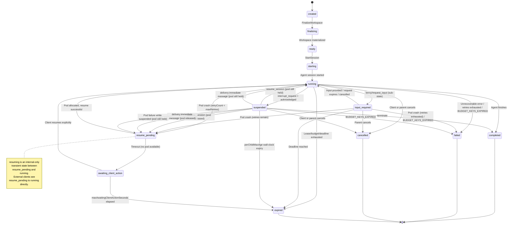
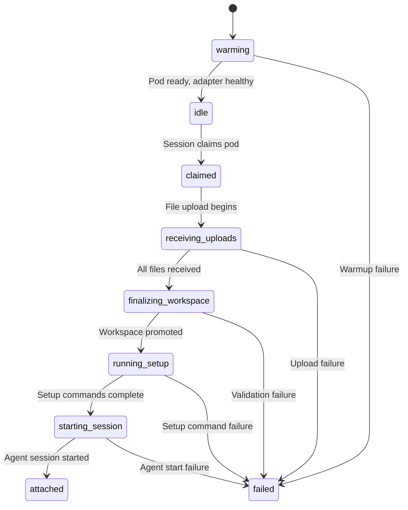
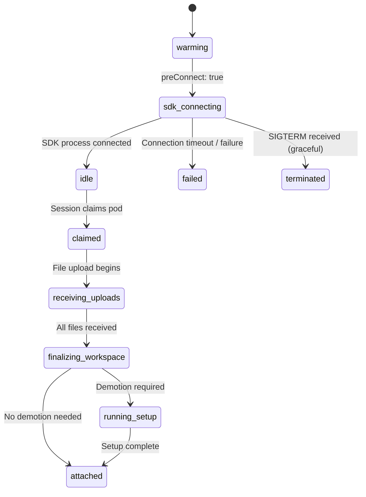
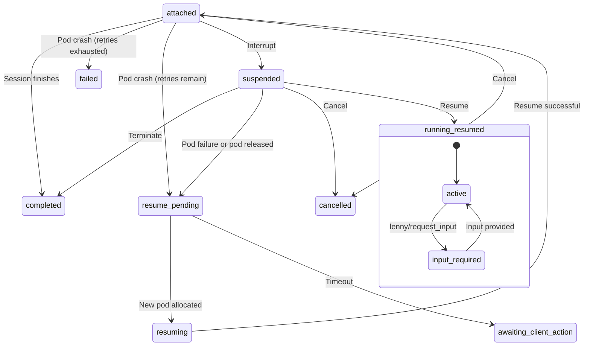
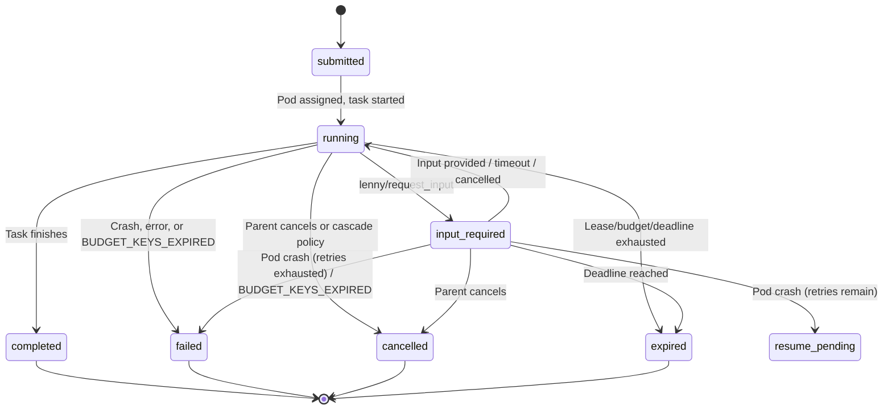
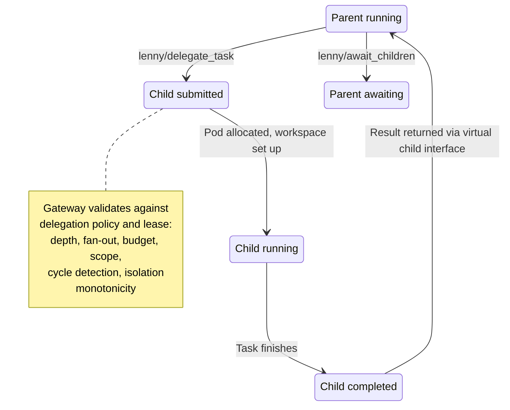
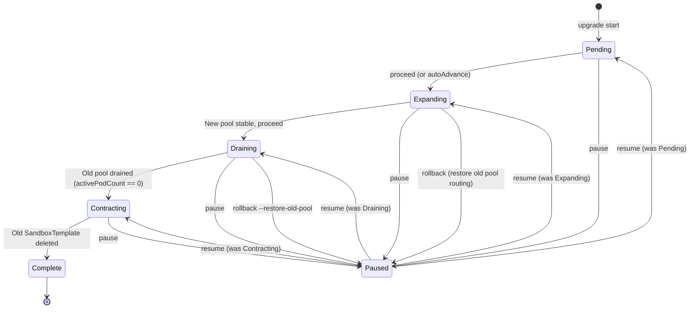

# State Machines
{: .no_toc }

Visual diagrams and transition tables for every state machine in the Lenny platform: sessions, pods, tasks, delegation chains, and pool upgrades.

  
Table of contents

  {: .text-delta }
- TOC
{:toc}

---

## Session state machine

The session state machine governs the lifecycle of every Lenny session as seen by clients through the REST API (`GET /v1/sessions/{id}`). Pod states (Section 6.2 of the spec) are internal and not exposed via the API.

### Diagram

### State descriptions

| State | Description |
|:------|:------------|
| `created` | Session record created in Postgres. Pod claimed. Credential lease assigned. Upload token issued. Waiting for workspace upload. Governed by `maxCreatedStateTimeoutSeconds` (default: 300s). |
| `finalizing` | `FinalizeWorkspace` called. Staging files validated and promoted to `/workspace/current`. Setup commands executing. |
| `ready` | Workspace materialized. Pod ready to start the agent session. |
| `starting` | `StartSession` called. Agent binary launching. For SDK-warm pods, `ConfigureWorkspace` points the pre-connected session at the finalized workspace. |
| `running` | Agent session active. Bidirectional streaming between client and pod via gateway. |
| `input_required` | Sub-state of `running` (not a peer state). Pod is live and runtime is active, but the agent is blocked inside `lenny/request_input` awaiting a response. Visible to clients via `status_change(state: "input_required")`. The session remains logically `running` while in this sub-state. |
| `suspended` | Session paused via interrupt. Pod may still be held (up to `maxSuspendedPodHoldSeconds`). `maxSessionAge` timer paused. `maxIdleTimeSeconds` timer paused. `perChildMaxAge` continues ticking. |
| `resume_pending` | Pod lost or released. Gateway is attempting to allocate a new pod. `maxResumeWindowSeconds` timer running. |
| `resuming` | **Internal-only state.** New pod allocated; workspace checkpoint replaying and session file restoring. External clients never see this state -- the API reports the transition as `resume_pending` to `running` directly. |
| `awaiting_client_action` | Automatic retries exhausted or `maxResumeWindowSeconds` elapsed. Client intervention required. Expires after `maxAwaitingClientActionSeconds` (default: 900s). Active children continue running. |
| `completed` | Terminal. Agent finished normally. Workspace sealed and exported. |
| `failed` | Terminal. Unrecoverable error, retries exhausted, or `BUDGET_KEYS_EXPIRED`. |
| `cancelled` | Terminal. Client or parent explicitly cancelled the session. |
| `expired` | Terminal. Session deadline, lease expiry, or budget exhausted. |

### Transition table

| From | To | Trigger | API endpoint / event |
|:-----|:---|:--------|:---------------------|
| `created` | `finalizing` | Client calls FinalizeWorkspace | `POST /v1/sessions/{id}/finalize` |
| `finalizing` | `ready` | Workspace validation and setup complete | Internal |
| `ready` | `starting` | Client calls StartSession | `POST /v1/sessions/{id}/start` |
| `starting` | `running` | Agent binary starts successfully | Internal |
| `running` | `suspended` | Interrupt acknowledged (or timeout) | `POST /v1/sessions/{id}/interrupt` |
| `running` | `input_required` | Runtime calls `lenny/request_input` | Internal (pod -> gateway) |
| `running` | `completed` | Agent finishes | Internal |
| `running` | `failed` | Crash, unrecoverable error, retries exhausted | Internal |
| `running` | `cancelled` | Cancel request | `DELETE /v1/sessions/{id}` |
| `running` | `expired` | Deadline/budget/lease exhausted | Internal timer |
| `running` | `resume_pending` | Pod crash with retries remaining | Internal |
| `input_required` | `running` | Input provided, request expires, or cancelled | `POST /v1/sessions/{id}/elicitations/{elicitation_id}/respond` |
| `input_required` | `cancelled` | Parent cancels | Internal |
| `input_required` | `expired` | Deadline reached | Internal timer |
| `input_required` | `resume_pending` | Pod crash with retries remaining | Internal |
| `input_required` | `failed` | Pod crash, retries exhausted | Internal |
| `suspended` | `running` | Resume (pod still held) | `POST /v1/sessions/{id}/resume` or `delivery:immediate` message |
| `suspended` | `resume_pending` | Resume or `delivery:immediate` message (pod released), or pod failure | `POST /v1/sessions/{id}/resume` or `delivery:immediate` message |
| `suspended` | `completed` | Terminate | `POST /v1/sessions/{id}/terminate` |
| `suspended` | `cancelled` | Cancel | `DELETE /v1/sessions/{id}` |
| `suspended` | `expired` | `perChildMaxAge` wall-clock expiry | Internal timer |
| `suspended` | `failed` | `BUDGET_KEYS_EXPIRED` | Internal |
| `resume_pending` | `running` | Pod allocated and resume successful (internal-only `resuming` state is traversed transparently) | Internal |
| `resume_pending` | `awaiting_client_action` | `maxResumeWindowSeconds` elapsed | Internal timer |
| `awaiting_client_action` | `running` | Client resumes explicitly | `POST /v1/sessions/{id}/resume` |
| `awaiting_client_action` | `expired` | `maxAwaitingClientActionSeconds` elapsed | Internal timer |

---

## Pod state machine

Pod states are internal to the platform and are NOT exposed via the client API. They track the pod's lifecycle from warm pool creation through session execution to termination.

### Pod-warm path diagram

### SDK-warm path diagram

### Session-phase transitions (from attached)

### Task-mode transitions

| From | To | Trigger |
|:-----|:---|:--------|
| `attached` | `task_cleanup` | Task completes (adapter sends `task_complete`) |
| `attached` | `cancelled` | Cancel signal received |
| `attached` | `failed` | Pod crash (no retries) |
| `attached` | `resume_pending` | Pod crash (retries remain) |
| `cancelled` | `task_cleanup` | Cancellation acknowledged |
| `task_cleanup` | `idle` | Scrub succeeds, limits not reached |
| `task_cleanup` | `idle [scrub_warning]` | Scrub fails, `onCleanupFailure: warn`, below threshold |
| `task_cleanup` | `draining` | Scrub fails beyond threshold, or task/uptime limit reached |
| `task_cleanup` | `sdk_connecting` | `preConnect: true`, scrub succeeds, limits not reached |
| `task_cleanup` | `failed` | `onCleanupFailure: fail` |
| `idle` | `draining` | `maxPodUptimeSeconds` exceeded |
| `draining` | `terminated` | Replacement provisioned |

### Concurrent-workspace transitions

| From | To | Trigger |
|:-----|:---|:--------|
| `idle` | `slot_active` | First slot assigned |
| `slot_active` | `slot_active` | Additional slot assigned or slot completes |
| `slot_active` | `idle` | Last active slot completes |
| `slot_active` | `draining` | Slot failure threshold exceeded or uptime limit |
| `idle` | `draining` | `maxPodUptimeSeconds` exceeded |
| `draining` | `terminated` | All slots complete, replacement provisioned |

Per-slot sub-states: `slot_assigned` -> `receiving_uploads` -> `running` -> `slot_cleanup`.

---

## Task state machine (canonical)

Lenny defines its own task states independent of any external protocol. External protocol adapters (MCP, A2A) map to/from these states at the boundary.

### Diagram

### Protocol mapping

| Lenny state | MCP Tasks | A2A (future) |
|:------------|:----------|:-------------|
| `submitted` | `submitted` | `submitted` |
| `running` | `working` | `working` |
| `completed` | `completed` | `completed` |
| `failed` | `failed` | `failed` |
| `cancelled` | `canceled` (MCP spelling) | `canceled` (A2A spelling) |
| `expired` | `failed` + error code | `failed` + error metadata |
| `input_required` | `input_required` | `input-required` |

### Session-level state mapping for external protocols

Lenny session states that do not map 1:1 to task states:

| Lenny session state | MCP Tasks surface | A2A surface |
|:--------------------|:------------------|:------------|
| `created` | `submitted` | `submitted` |
| `ready` | `submitted` | `submitted` |
| `starting` | `submitted` | `submitted` |
| `finalizing` | `submitted` | `submitted` |
| `suspended` | `working` + `metadata.suspended: true` | `working` + `metadata.suspended: true` |
| `resume_pending` | `working` + `metadata.resuming: true` | `working` + `metadata.resuming: true` |
| `awaiting_client_action` | `input_required` | `input-required` |

Pre-running states are collapsed to `submitted`. `suspended` and `resume_pending` are surfaced as `working` with metadata because they may resume autonomously.

---

## Delegation state machine

Delegation chains are managed by the gateway. Each delegation creates a child session with its own session lifecycle. The parent-child relationship is tracked via the delegation lease.

### Delegation flow

### Delegation lifecycle stages

1. **Parent calls `lenny/delegate_task`** -- Gateway validates policy, depth, budget, cycle detection, and isolation monotonicity.
2. **Gateway exports files** from parent workspace per export spec.
3. **Gateway allocates child pod** from specified pool.
4. **Gateway streams files** into child workspace.
5. **Child session starts** with its own session lifecycle.
6. **Gateway creates virtual MCP child interface** injected into parent.
7. **Parent interacts** with child through virtual interface (status, elicitation forwarding, cancellation).
8. **Child reaches terminal state** -- result available to parent via `lenny/await_children`.
9. **On parent pod failure** -- virtual child interfaces reconstructed from `session_tree_archive` on resume. `children_reattached` event sent.

### Delegation budget enforcement

Budget is tracked via Redis Lua scripts (`budget_reserve.lua`, `budget_return.lua`). Each `LeaseSlice` specifies:

- `maxTokenBudget` -- tokens allocated to child tree
- `maxChildrenTotal` -- max children the child may spawn
- `maxTreeSize` -- contribution limit toward tree-wide pod cap
- `maxParallelChildren` -- max concurrent children
- `perChildMaxAge` -- wall-clock seconds for child

Budget checks are enforced at every delegation hop. Scope can only narrow, never widen (scope narrowing principle).

---

## Pool upgrade state machine

Runtime image upgrades follow a tracked, pauseable state machine managed via `lenny-ctl admin pools upgrade`.

### Diagram

### State descriptions

| State | Description | Entry condition | Exit condition |
|:------|:------------|:----------------|:---------------|
| `Pending` | Upgrade registered. Both old and new `SandboxTemplate` CRDs exist. New pool has `minWarm: 0`. | `lenny-ctl admin pools upgrade start` | `proceed` or `autoAdvance: true` |
| `Expanding` | New pool ramping up. `minWarm` set to target. New sessions routed to new pool (or canary split via `canaryPercent`). | Proceed from `Pending` | New pool `idlePodCount >= minWarm` for `stabilizationWindowSeconds` (default: 120s) and health check passes. |
| `Draining` | Old pool accepts no new sessions (`minWarm = 0`). Existing sessions run to completion. | Proceed from `Expanding` | Old pool `activePodCount == 0` or `drainTimeoutSeconds` expires. On timeout, remaining sessions force-terminated with checkpoint. |
| `Contracting` | Old `SandboxTemplate` CRD and pool record being deleted. | Proceed from `Draining` | Old pool deletion confirmed. |
| `Complete` | Upgrade finished. Only new pool remains. | Proceed from `Contracting` | Terminal. |
| `Paused` | All state machine activity halted. New pool may continue serving; old pool retains current state. | `pause` from any non-terminal state | `resume` |

### Rollback procedures

| From state | Command | Behavior |
|:-----------|:--------|:---------|
| `Expanding` | `lenny-ctl admin pools upgrade rollback` | Sets new pool `minWarm` to 0, restores full routing to old pool, transitions to `Paused`. |
| `Draining` or `Contracting` | `lenny-ctl admin pools upgrade rollback --restore-old-pool` | Recreates old pool from `RuntimeUpgrade.previousPoolSpec` and restores routing. Only valid while old `SandboxTemplate` CRD still exists. |
| Late `Contracting` (CRD deleted) | Manual recreation | Operator must manually recreate old `SandboxTemplate` from version control or Helm values. |

### Safety invariant

The old `SandboxTemplate` CRD is never deleted until the state machine explicitly reaches `Contracting` -> `Complete`. The WarmPoolController blocks `SandboxTemplate` deletion when an active `RuntimeUpgrade` references it.
