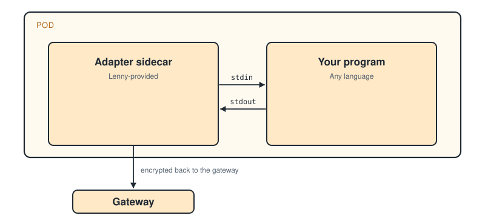

# Runtime Author Guide

## Who this guide is for

Anyone building a runtime to be deployed and run in a sandboxed pod by Lenny. Lenny supports two kinds of runtime: **agents** and **MCP servers**. Common starting points:

- A specialized worker, AI or not, that defines a protocol or syntax on top of Lenny's messages API. It can call an LLM, or it can do deterministic work (file processing, code analysis, test running) and return structured results and errors to the client.
- An adapter that wraps an existing harness such as Claude Code, Cursor CLI, Gemini CLI, or Codex, or an agent framework such as LangGraph, CrewAI, or Mastra, and runs it under Lenny.
- An MCP server you want Lenny to host so it gets pod isolation, credential management, and pool scaling without knowing anything about Lenny.

If you are deploying Lenny to a cluster, calling its API from an application, or adding a connector to an external tool, see the Operator Guide, the Client Guide, or the connector documentation instead.

---

## Shortcuts by starting point

Before you read the whole guide, pick the shortcut that matches what you're building:

| Runtime | Do this |
| :--- | :--- |
| **Commonly used harnesses** | Fork one of the reference CLI wrappers (`claude-code`, `gemini-cli`, `codex`, `cursor-cli`). They share a Dockerfile skeleton, workspace layout, and sandbox profile; only the image, credential, and launch command differ. Read [Pod Lifecycle](lifecycle.md), run the [conformance suite](testing.md) against your image, then follow [Publishing](publishing.md). |
| **Custom-built agents using a common framework** (LangGraph, Mastra, CrewAI) | Fork the corresponding reference runtime — `langgraph`, `mastra`, `crewai`. These are fully integrated and vetted so you get checkpoints, interrupts, and credential rotation without writing them. Validate with the [conformance suite](testing.md) before publishing. |
| **From scratch** | Scaffold with `lenny runtime init my-agent --language <go\|python\|typescript> --template <minimal\|chat\|coding>`, read the [Echo Runtime Sample](echo-runtime.md), then continue with the full reading order below. |

---

## What "runtime" means in Lenny

Lenny runs two kinds of runtime.

An **agent runtime** generally participate in a conversational sessions (`session` mode). It receives messages, holds a workspace, can delegate to other runtimes, and can elicitate the user. For high-throughput, stateless conversations, agent runtimes can be configured to run in `service` mode.

An **MCP server runtime** is a _stateless_ MCP server that Lenny hosts behind its pod isolation, credential management, and pool scaling. It has no session lifecycle and needs to know nothing about Lenny. See [Integration Levels](integration-levels.md#type-mcp-runtimes) for more information.

The rest of this guide is about agent runtimes.

### The standard model: an adapter sidecar

In the standard model, your agent runtime runs inside a Kubernetes pod next to a small adapter sidecar that Lenny provides. The sidecar handles the platform plumbing: the connection back to the gateway, delivering the session's files into the pod, managing credentials, and answering health checks. Your program reads messages as JSON lines on stdin and writes replies as JSON lines on stdout. That stdin/stdout JSON-lines exchange is the whole contract you implement.



<!--
ASCII fallback for the diagram above (runtime-pod-simple):

                       Pod
   +----------------------------------------------+
   |                                              |
   |  +------------------+  stdin   +-----------+ |
   |  |                  | ========>|           | |
   |  | Adapter sidecar  |          | Your      | |
   |  | (Lenny-provided) | <========| program   | |
   |  |                  |  stdout  |           | |
   |  +--------+---------+          +-----------+ |
   |           | encrypted back to the gateway   |
   +-----------|----------------------------------+
               v
           Gateway
-->

A few consequences:

- **Any language works.** If it can read and write JSON lines, it can be a Lenny runtime.
- **You don't need a Lenny dependency.** The simplest integration has zero imports from Lenny. If you'd like more ergonomic code, official SDKs are available for Go, Python, and TypeScript (covered below).
- **You integrate deeper only when you need to.** The basic integration is about 50 lines. More capabilities are available when you want them, without rewriting what you have.
- **Isolation depends on the execution mode.** In `session` mode each session gets its own pod with its own filesystem and namespaces, and sessions never share memory or state. Depending on the pool's configuration, the pod can also be sandboxed under gVisor or run in a microVM via Kata Containers. In `service` mode a pod is shared across requests for throughput, which gives weaker isolation: same-tenant requests share the pod's process namespace, memory, `/tmp`, and network namespace. Service-mode pods are tenant-pinned, so a single pod never serves two tenants.
- **Delegation is backstopped.** When your runtime calls `lenny/delegate_task`, the gateway enforces the child's budget, scope, and isolation bounds. You don't have to trust other runtimes, or your own code, to honor them.

### The embedded alternative

A runtime can instead embed the adapter and speak the gateway's gRPC contract directly, with no separate sidecar container. This replaces the stdin/stdout JSON-lines protocol with the full gRPC contract, so it is limited to Go (or another language with gRPC support) and is significantly more work to implement. It is intended for first-party, latency-sensitive runtimes where the adapter and the agent are developed together.

Use the sidecar model unless you have a specific reason not to. Everything in this guide assumes it.

---

## SDKs and scaffolding

You don't have to implement the wire format yourself. Lenny publishes official SDKs that handle stdin/stdout message parsing, the extended protocol features you opt into, and the lifecycle signals:

| Language                | Install                                      |
| ----------------------- | -------------------------------------------- |
| Go                      | `go get github.com/lennylabs/runtime-sdk-go` |
| Python                  | `pip install lenny-runtime`                  |
| TypeScript / JavaScript | `npm install @lennylabs/runtime-sdk`         |

The SDKs are thin wrappers, not frameworks. They expose whichever integration level you want; you can always drop to raw JSON if your language isn't represented or you'd rather keep the dependency footprint to zero.

### Scaffold a new runtime

`lenny runtime init` emits a working repository -- Dockerfile, entry point in your language, runtime manifest, Makefile, and CI workflow. See [Runtime Configuration](runtime-configuration.md) for the manifest fields and pool settings the scaffold produces.

```bash
lenny runtime init my-agent --language go --template coding
lenny runtime init my-chat  --language python --template chat
lenny runtime init hello    --language typescript --template minimal
```

The templates cover the common starting points:

- `coding` -- a coding agent. Pre-wired for a git-backed workspace, common toolchains inside the container, and sandboxed isolation.
- `chat` -- a minimal non-coding runtime that talks to an LLM and streams replies.
- `minimal` -- a plain hello-world that echoes each message.

Validate and publish:

```bash
lenny runtime validate                                    # checks your manifest and adapter conformance
lenny runtime publish my-agent \
  --image ghcr.io/my-org/my-agent:0.1.0                   # pushes the image and registers it
```

### Reference runtimes you can learn from (or fork)

Lenny ships first-party `type: agent` runtimes you can read, fork, or register as-is. Each lives in its own repository under `github.com/lennylabs/runtime-<name>`. They fall into three categories: coding agents that wrap an existing CLI, a general-purpose chat runtime, and framework adapters that bridge an agent framework or external API to Lenny.

| Runtime | Category | Integration level | What it is |
| --- | --- | --- | --- |
| `claude-code`, `gemini-cli`, `codex`, `cursor-cli` | Coding agents | Full | CLI wrappers for the named coding harness running in a Lenny-managed sandbox. |
| `chat` | General-purpose | (see its repository) | Talks to an LLM with no tools; the reference for a custom non-coding runtime. |
| `langgraph` | Framework adapter | Full | Runs LangGraph graph-based agents (Python) under Lenny. |
| `mastra` | Framework adapter | Full | Runs the Mastra agent framework (TypeScript) under Lenny. |
| `openai-assistants` | Framework adapter | Full | Adapts the OpenAI Assistants API to Lenny's session lifecycle. OpenAI's hosted `code_interpreter` runs in OpenAI's infrastructure, outside Lenny's sandbox. |
| `crewai` | Framework adapter | Full | Runs the CrewAI multi-agent framework, with its delegation wired to `lenny/delegate_task`. |

The coding-agent runtimes are near-identical CLI wrappers: same workspace layout, same pre-installed toolchains, same sandbox profile. They differ only in the image, the LLM credential, and the command the container runs. If you're wrapping a CLI, start there.

---

## The integration levels

Lenny support three integration levels for agent runtimes via JSONL, each providing additional capabilities on top of the previous one: Basic, Standard, and Full.

### Basic

The minimum integration level required for a runtime to execute on Lenny.

Included:

- Messages in, responses out.
- File access to the session's workspace through a small built-in tool vocabulary (`read_file`, `write_file`, `list_dir`, `delete_file`).
- A shortcut response format for simple replies: `{"type": "response", "text": "hello"}`.

Not included:

- Delegation to other agents.
- Asking the user for input mid-session (elicitation).
- Access to connectors (GitHub, Jira, Slack, etc.).
- Clean interrupt handling or graceful checkpoints.
- Advance warning before a deadline.

Use this level for stateless workers, simple wrappers around existing CLIs, and anything you want to prototype fast.

### Standard

On top of Basic, your program also opens a connection to a local tool server that the sidecar exposes. Through that connection you get:

- Delegation -- spawn a child session on another runtime and await its result.
- Mid-session user input (elicitation) -- ask the human a question and wait for their reply.
- Persistent memory that survives beyond the current session.
- Inter-session messaging -- `lenny/send_message(to, message)` sends a point-to-point message to another session by ID (same-tenant only, scoped by `messagingScope`), and your runtime receives messages through its gateway-managed inbox. There is no broadcast. See [Platform Tools](platform-tools.md).
- Connector tool access. A connector is an external MCP server you register with Lenny; the gateway proxies its tools into your pod, scoped by the session's DelegationPolicy. This is how an agent runtime reaches external tools. A `type: mcp` runtime's tools are not callable by agent runtimes in v1; register that server as a connector instead.

Use this level when your agent needs to call out to tools, delegate work, or talk to a human while it's running. About 150-200 lines of code plus an MCP client library.

### Full

On top of Standard, your program also opens a lifecycle channel -- a second connection that carries operational signals from the platform.

With it, you can support:

- Graceful checkpoints, where the platform asks your agent to pause at a consistent point and take a snapshot.
- Clean interrupts, where the agent is told to stop and acknowledges when it's reached a safe point.
- In-place credential rotation: the platform hands you a new credential and you acknowledge the swap, with no restart. At the Standard and Basic levels a credential change instead terminates the pod and starts a replacement, which is a restart; see the Credential Rotation section of [Pod Lifecycle](lifecycle.md) for when and why a restart happens at each level.
- Advance warning before a deadline, so you can wrap up gracefully instead of being terminated.
- Coordinated draining when the pool is shutting down.

Pod recycling (`recycle.enabled`) requires no runtime cooperation and works at every integration level; the per-slot cleanup and the whole-pod scrub are adapter-executed and gateway-coordinated.

Use this level for agents that need to survive pod failures, handle interrupts, and rotate credentials without restarting. About 300-400 lines of code, including a small background thread or process to handle lifecycle signals.

---

## Where to read next

### To get something running fast (Basic level)

1. Scaffold a runtime: `lenny runtime init <name> --language <lang> --template minimal`.
2. Read the [Echo Runtime Sample](echo-runtime.md) for a complete working example you can copy.
3. Skim the [Adapter Contract](../reference/adapter-contract.md) for the exact message formats.
4. Use the [Integration Levels](integration-levels.md) reference to confirm what you can ignore at this level.
5. Use [Local Development](local-development.md) to run your runtime against `lenny up`.
6. Run the [conformance suite](testing.md) before you publish.

### To add delegation, connectors, or mid-session prompts (Standard level)

Read everything above, then:

7. [Platform Tools](platform-tools.md) -- every tool Lenny exposes to your agent, with parameters and examples.
8. [Delegation](delegation.md) -- spawning child tasks, enforcing budgets, handling results.
9. [Pod Lifecycle](lifecycle.md) -- what happens when a pod starts and stops.

### To support checkpoints, clean interrupts, and credential rotation (Full level)

Full integration is the lifecycle channel and the handlers it carries. [Pod Lifecycle](lifecycle.md) walks through each one, with the message formats inline; read its Checkpointing, Interrupt and Suspend, Credential Rotation, Deadline Signals, and Task-Mode Pod Reuse sections, each of which is marked Full level. Read everything above, then:

10. [Pod Lifecycle](lifecycle.md) -- the checkpoint, interrupt/suspend, credential-rotation, deadline-signal, and pod-reuse handshakes you implement at this level.
11. [Runtime Configuration](runtime-configuration.md) -- the manifest fields and pool settings that enable these capabilities.
12. [Platform Tools](platform-tools.md) -- the tools your lifecycle handlers call while quiescing, flushing, or wrapping up.

### When you're ready to ship

13. [Testing](testing.md) -- the full conformance suite for your integration level.
14. [Publishing](publishing.md) -- packaging the container, registering the runtime, and Helm integration.

---

## Fast path: scaffold, build, publish

The shortest route from an empty directory to a runtime running on Lenny:

```bash
# 1. Scaffold a repo in the language you want
lenny runtime init my-agent --language go --template chat
cd my-agent

# 2. Fill in your agent logic. The scaffold already handles message
#    parsing, heartbeats, and clean shutdown.

# 3. Build the container
make image

# 4. Register it against a running gateway -- the embedded stack is fine
lenny up
lenny runtime publish my-agent --image my-agent:dev

# 5. Try it
lenny session new --runtime my-agent --message "Hello"
```

If you want to see the raw protocol first, the [Echo Runtime Sample](echo-runtime.md) is an annotated Go program that implements the Basic level with zero Lenny dependencies. Read it before picking up the SDK to understand the wire format up front.
