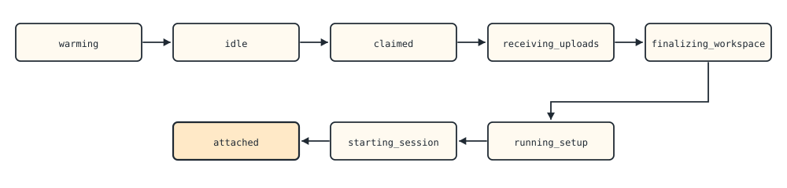
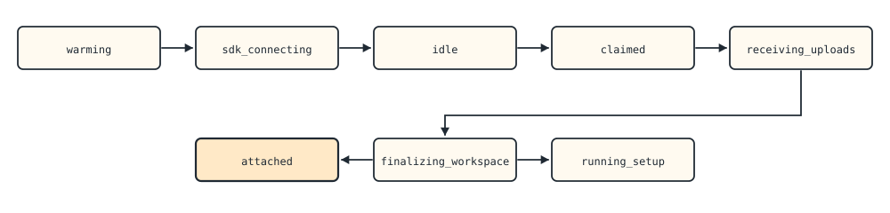
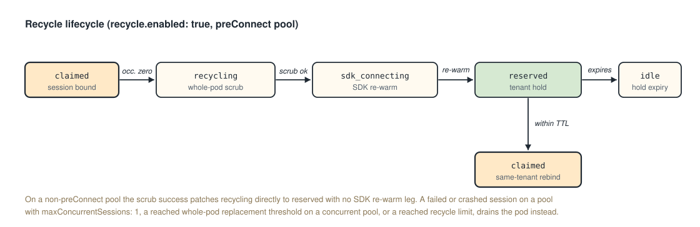

# Pod Lifecycle

This page covers the lifecycle of a Lenny agent pod, from pre-warming through session execution to termination. The states described here apply to `type: agent` runtimes, which hold a workspace and run a session. `type: mcp` runtimes have no session lifecycle and follow a different model; see [Integration Levels](integration-levels.md#type-mcp-runtimes). Understanding these states helps you write a runtime that handles startup, checkpointing, interrupts, and shutdown correctly.

Several capabilities on this page depend on the runtime's integration level. Basic, Standard, and Full are defined in [Integration Levels](integration-levels.md); each section notes which level it requires.

---

## Pod States

Every Lenny agent pod follows a state machine. The exact path depends on whether the pool uses **pod-warm** (default) or **SDK-warm** (`preConnect: true`) mode.

### Pod-Warm Path (Default)



<!--
ASCII fallback for the diagram above (pod-warm-path):

  warming ===> idle ===> claimed ===> receiving_uploads ===> finalizing_workspace
                                                                      |
                                                                      v
                            attached <=== starting_session <=== running_setup
-->


| State | What Happens |
|-------|-------------|
| `warming` | Pod is scheduled, container starts, adapter boots, health checks pass. No session is bound. |
| `idle` | Pod is healthy and claimable. Listed in the warm pool. `/workspace/slots/` exists and is empty; a session's slot tree is created at slot assignment. |
| `claimed` | Gateway has selected this pod for a session. No other session can claim it. |
| `receiving_uploads` | Client files are streaming into the session's `/workspace/slots/{sessionId}/staging`. |
| `finalizing_workspace` | Files are validated and promoted from `/workspace/slots/{sessionId}/staging` to `/workspace/slots/{sessionId}/current`. |
| `running_setup` | Setup commands (if any) execute in the workspace. Bounded by `setupTimeoutSeconds` (default: 300s). |
| `starting_session` | Your runtime process becomes live for the session. In the sidecar model the kubelet starts your binary through the runtime image's entrypoint when the pod starts, and your binary dials the adapter. The adapter accepts that connection at the pod's first session, and later sessions on the pod reach the same process. |
| `attached` | Session is live. Bidirectional message flow begins. |

### SDK-Warm Path (preConnect: true)



<!--
ASCII fallback for the diagram above (sdk-warm-path):

  warming ===> sdk_connecting ===> idle ===> claimed ===> receiving_uploads
                                                                  |
                                                                  v
                            attached <=== finalizing_workspace ===> running_setup
-->


In SDK-warm mode, the agent process starts during the warm phase (before any session) to eliminate cold-start latency. The adapter pre-connects the SDK, then waits for session assignment.

**Demotion:** If a claimed session's workspace includes files matching `sdkWarmBlockingPaths` (default: `["CLAUDE.md", ".claude/*"]`), the adapter tears down the pre-connected process, returns to pod-warm state, and proceeds via the normal path. This adds 1--3 seconds but ensures the agent starts with workspace files present.

---

## Session Binding

In the default `sessionPolicy` (`maxConcurrentSessions: 1`, `recycle.enabled: false`), a pod is bound to exactly one session for its entire lifetime. After the session completes or fails, the pod is terminated and replaced --- never reused for a different session. This prevents cross-session data leakage through residual files, cached DNS, or runtime memory.

**Recycling** relaxes this constraint: with `recycle.enabled: true` the pod is reused across sequential sessions, and with `maxConcurrentSessions > 1` it serves multiple simultaneous sessions. The per-slot cleanup and the whole-pod scrub are adapter-executed and gateway-coordinated, with no CH-RUNTIMEOPS exchange between sessions. Reuse requires a runtime that serves sequential sessions: your runtime process lives as long as the pod. On a recycling pool with `recycle.maxSessionsPerPod` above 1 and a `recycle.scrubProfile` other than `vm-restart`, which requires `sessionPolicy.acknowledgeProcessLevelIsolation: true`, your runtime process serves the pod's later sessions on the same connection, keyed by `sessionId`, up to `maxSessionsPerPod`. Each session opens with its `session_start` frame and ends with its `session_end` frame, as [Runtime Process Lifetime](#runtime-process-lifetime) states. A runtime that exits after its session makes the pod retire at the recycle boundary rather than serve the next session. The whole-pod scrub clears the shared paths and does not reach your runtime process. See the recycle lifecycle below.

---

## Runtime Process Lifetime

Your runtime process lives as long as the pod, and it serves any number of sessions over its life: one after another, and at once on a pool whose `sessionPolicy.maxConcurrentSessions` is greater than 1. In the sidecar model the one connection your binary dials carries every session the pod serves, multiplexed by `sessionId`; in the embedded model the adapter runs one runtime loop per session inside its own process. No session's teardown, interrupt, or heartbeat escalation closes the connection or sends your process a signal. The adapter closes the connection when the pod terminates, and when the coordinator hold times out with no new coordinator and the adapter terminates every session it started on the pod. A runtime process that stops, or whose connection the hold timeout closed, is not re-created or reconnected inside the pod: the adapter refuses the next session's start, and the pod is retired. A connection the adapter closes before the first protocol frame, because it refused the connection or the connection failed the nonce or challenge check, is different: read the manifest again and dial again, as the [Connection Handshake](../reference/adapter-contract.md#connection-handshake) states.

Each session is bracketed by frames on that connection or loop:

1. **`session_start`** opens the session and carries its own context: its `sessionId`, the path of its credential file, its experiment and tracing context, and its LLM configuration. It precedes every other frame addressed to the session.
2. **`session_started`** is your runtime's answer to `session_start`. A runtime that keeps per-session context writes it once it has created the session's context, with `error` when the creation failed; a runtime that has opened the CH-RUNTIMEOPS writes it for every `session_start`. A runtime that keeps neither may ignore `session_start` and write no `session_started`.
3. **`session_end`** releases the session. Release the session's context when it arrives and keep serving the pod's other sessions.

The end of the connection or loop ends every session it carries, with no `session_end`, and `shutdown` is a process-scoped signal that ends the process. No runtime relies on its process exiting at a session's end. Every session-scoped frame on stdin and on the CH-RUNTIMEOPS carries the `sessionId` of the session it concerns, so keep per-session state keyed by `sessionId`. The [Adapter Contract](../reference/adapter-contract.md#inbound-messages-adapter-writes-to-your-stdin) defines each frame, its fields, and the rules that govern it.

A session's context arrives in its `session_start` frame. The following is an example; a runtime that reads credential material takes the file's path from `credentialsPath`, and a Basic-level runtime that reads a credential file reads `credentialsPath` from the session's `session_start` frame to find it:

```json
{
  "type": "session_start",
  "sessionId": "sess_abc123",
  "startId": "st_1",
  "credentialsPath": "/run/lenny/slots/sess_abc123/credentials.json",
  "llm": { "deliveryMode": "proxy", "dialect": "anthropic", "apiKeyEnv": "ANTHROPIC_API_KEY" }
}
```

---

## Workspace Materialization

When a pod is claimed for a session, the gateway materializes the client's files into the workspace:

1. **Upload phase:** Files stream from the client through the gateway into the session's `/workspace/slots/{sessionId}/staging` on the pod. Each file is validated (no path traversal, no symlinks outside workspace, size limits enforced).

2. **Finalization:** The gateway promotes files from `/workspace/slots/{sessionId}/staging` to `/workspace/slots/{sessionId}/current`. Archive extraction (tar.gz, tar.bz2, zip) happens here with zip-slip protection.

3. **Setup commands:** If the runtime defines setup commands (e.g., `npm install`), they run in `/workspace/slots/{sessionId}/current` with a bounded timeout. Setup command output is captured for diagnostics.

4. **Session start:** Your runtime process receives the session's `session_start` frame and then its first message. The session's working directory is `/workspace/slots/{sessionId}/current`. In the sidecar model the kubelet started your binary through the runtime image's entrypoint when the pod started, your binary dialed the adapter, and the adapter accepted that connection at the pod's first session; later sessions on the pod reach the same process.

### Filesystem Layout

```
/workspace/
  slots/
    {sessionId}/
      current/  # This session's working directory --- populated during finalization
      staging/  # This session's upload staging area --- files land here first
  staging/      # Pod-global staging area, created at warm time
  shared/       # Pod-shared assets, populated at warm time  [read-only]
/sessions/
  {sessionId}/  # This session's files (conversation logs, runtime state)  [tmpfs]
/artifacts/
  {sessionId}/  # This session's logs, outputs, checkpoints
/tmp/           # Writable scratch area, shared across the pod's sessions  [tmpfs]
```

No pod-global working directory (`/workspace/current`) exists. Every session's working directory is `/workspace/slots/{sessionId}/current`, derived from its own session identifier.

The trees shared across the pod's sessions are the pod-global `/workspace/staging`, the read-only `/workspace/shared/`, and the writable scratch area `/tmp/`.

- `/sessions/` and `/tmp/` use tmpfs (data is guaranteed gone when the pod terminates).
- `/workspace/` and `/artifacts/` use disk-backed emptyDir. Node-level disk encryption is required for production.

### Adapter Manifest

Before your binary starts, the adapter writes `/run/lenny/adapter-manifest.json`. The manifest is one pod-global file that carries only pod-scoped fields; a session's own context arrives in its `session_start` frame. A Basic-level runtime reads only `mcpNonce` from it for core operation, and only when it dials the message channel as a socket. At the Standard level, you read it to discover MCP server sockets:

```json
{
  "platformMcpServer": {
    "socket": "@lenny-platform-mcp"
  },
  "connectorServers": [
    { "id": "github", "socket": "@lenny-connector-github" }
  ],
  "mcpNonce": "a1b2c3d4e5f6..."
}
```

The [Adapter Contract](../reference/adapter-contract.md#adapter-manifest) lists every manifest field and the connection handshake that presents `mcpNonce`.

---

## Session States (From Attached)

Once a session reaches `attached`, it enters the interactive session state machine:


<!--
ASCII fallback for the diagram above (session-states):

                          attached
                             |
      +----------+-----------+-----------+------------+
      v          v           v           v            v
  completed   failed   resume_pending  suspended   cancelled
                            |              |
                       +----+----+    +----+----+-------+
                       v         v    v         v       v
                   resuming  awaiting  running  completed  resume_pending
                       |     _client_  (resume)
                       v      action
                   attached     |
                                v
                              expired
-->


### Key States

| State | Meaning |
|-------|---------|
| `running` | Session is active. Your binary is processing messages. |
| `input_required` | Sub-state of `running`. Your runtime called `lenny/request_input` and is blocked waiting for a response. |
| `suspended` | Session is paused via `interrupt_request`. Pod is held (initially). `maxSessionAge` timer is paused. |
| `resume_pending` | Pod failed. Gateway is acquiring a new pod for recovery. |
| `resuming` | Workspace is being restored onto a new pod. |
| `awaiting_client_action` | Auto-retries exhausted. Client must decide: resume, terminate, or download artifacts. |
| `completed` | Session finished normally. Terminal state. |
| `failed` | Unrecoverable error or retries exhausted. Terminal state. |
| `cancelled` | Client or parent cancelled the session. Terminal state. |
| `expired` | Budget, lease, or deadline exhausted. Terminal state. |

---

## Checkpointing

Checkpointing creates a snapshot of the workspace so the session can recover after pod failure. The behavior depends on your integration level.

### Basic level: no checkpoint

The adapter performs **no checkpoint**. If the pod fails, all in-flight context is lost. The gateway restarts the session from the last gateway-persisted state, which may be significantly behind your runtime's actual progress.

This is acceptable for idempotent or stateless workloads.

### Standard level: best-effort snapshot

The adapter takes **best-effort snapshots** without pausing your runtime. The workspace is snapshotted while your binary continues running, so files written during the snapshot window may be inconsistent. On resume, minor workspace inconsistencies are possible.

For most workloads this is sufficient.

### Full level: cooperative checkpoint

Full-level runtimes participate in a handshake that guarantees **consistent snapshots**:

```
1. Adapter sends checkpoint_request on the CH-RUNTIMEOPS:
   {"type":"checkpoint_request","sessionId":"sess_abc123","checkpointId":"chk_42","deadlineMs":60000}

2. Your runtime:
   - Finishes current output write
   - Flushes all buffers
   - Ensures workspace files are in a consistent state
   - Does NOT exit or stop processing permanently

3. Your runtime replies:
   {"type":"checkpoint_ready","checkpointId":"chk_42"}

4. Adapter snapshots the workspace filesystem.

5. Adapter sends checkpoint completion:
   {"type":"checkpoint_complete","sessionId":"sess_abc123","checkpointId":"chk_42","status":"ok"}

6. Your runtime resumes normal operation.
```

If `checkpoint_ready` is not received within `deadlineMs` (default 60 seconds), the adapter falls back to best-effort snapshot and sets a `checkpointStuck` health flag. Your process is not killed --- it continues running, but the checkpoint may be inconsistent.

---

## Resume After Pod Failure

When a pod fails (eviction, OOM, node failure), the gateway attempts automatic recovery:

1. Gateway detects the failure and classifies it (retryable vs. non-retryable).
2. If retryable and `retryCount < maxRetries`:
   - Session transitions to `resume_pending`.
   - Gateway allocates a new warm pod.
   - Recreates the same workspace directory structure.
   - Replays the latest checkpoint.
   - Restores session state.
   - Resumes the session.
3. If retries exhausted, session becomes `awaiting_client_action`.

Your runtime does not need to implement any resume logic --- the adapter handles it. From your binary's perspective, the resumed session arrives as a new start: its `session_start` frame, followed by its first `message`.

### The `session.resumed` Event

After a successful resume, the client receives a `session.resumed` event:

```json
{
  "type": "session.resumed",
  "resumeMode": "full",
  "workspaceLost": false
}
```

- `resumeMode`: how much state was restored. Common values are `full` (workspace restored from the latest checkpoint) and `conversation_only` (no workspace; conversation context only). The gateway emits additional values for partial-workspace and coordinator-handoff recoveries. The client reads this field; your runtime does not act on it.
- `workspaceLost`: `true` if the workspace snapshot was unavailable or corrupt.

The client receives this event. Your runtime does not emit or handle it.

---

## Interrupt and Suspend (Full level)

Full-level runtimes can handle clean interrupts via the CH-RUNTIMEOPS:

```
1. Adapter sends interrupt_request:
   {"type":"interrupt_request","sessionId":"sess_abc123","interruptId":"int_001","deadlineMs":30000}

2. Your runtime reaches a safe stop point (finishes current output, flushes).

3. Your runtime replies:
   {"type":"interrupt_acknowledged","interruptId":"int_001"}

4. Session transitions to "suspended".
```

While suspended:
- Pod is held (initially) and workspace is preserved.
- `maxSessionAge` timer is paused.
- After `maxSuspendedPodHoldSeconds` (default: 900s / 15 minutes), the gateway checkpoints and releases the pod.
- The session can be resumed by the client sending a new message or calling `resume_session`.

At the Basic and Standard levels there is no clean interrupt: your runtime process receives no signal, and it keeps running.

---

## Credential Rotation

When a provider credential is rate-limited, expires, or is revoked, the platform rotates it. Whether this force-restarts your runtime mid-session depends on your integration level: at the Full level rotation happens in place with no restart, while at the Standard and Basic levels a credential change terminates the pod and starts a replacement, which is a restart. Standard preserves context through a best-effort checkpoint; Basic loses in-flight context because it has no checkpoint.

| Level | Method | Session Impact |
|------|--------|----------------|
| **Full** | `credentials_rotated` on CH-RUNTIMEOPS; runtime rebinds in-place | No session interruption |
| **Standard** | Gateway triggers a best-effort checkpoint, terminates the pod, and resumes on a new pod with the new credential | Brief pause; client sees a reconnect |
| **Basic** | Pod restart with the new credential. Basic has no checkpoint, so in-flight context is lost and the session restarts from the last gateway-persisted state | Pause and loss of in-flight context |

### Full-level credential rotation

```
1. Adapter sends on CH-RUNTIMEOPS:
   {"type":"credentials_rotated","sessionId":"sess_abc123","provider":"anthropic","credentialsPath":"/run/lenny/slots/sess_abc123/credentials.json","leaseId":"lease_xyz"}

2. Your runtime re-reads the credential file named by `credentialsPath` and rebinds the provider client of the session `sessionId` names to the new credential.

3. Your runtime replies:
   {"type":"credentials_acknowledged","leaseId":"lease_xyz","provider":"anthropic"}
```

---

## Deadline Signals (Full level)

Full-level runtimes that declare the `deadline_signal` capability receive advance warning before a session's expiry, addressed to that session by `sessionId`:

```json
{"type":"deadline_approaching","sessionId":"sess_abc123","remainingMs":60000,"trigger":"session_age"}
```

This gives your runtime time to wrap up the session's long-running work, flush outputs, and produce a partial result before the hard deadline arrives. Answer the session's in-flight `message`, if any, before `remainingMs` elapses, and write no other `response` for the session in reply to this frame. Your runtime keeps running and keeps serving the pod's other sessions.

At the Basic and Standard levels there is no advance notice of a session's expiry, and your runtime process receives no signal when the session expires.

---

## Session End

The adapter writes `session_end` on stdin when a session it started ends on the runtime, at every integration level:

```json
{"type":"session_end","sessionId":"sess_abc123"}
```

On `session_end`, release the context of the session's latest start and keep running: the process serves the pod's other sessions and later ones. The frame is not acknowledged and carries no deadline. After it, write no further frame for the session, except a `session_started` still owed for a `session_start` read before it and the `llm_request_completed` of a request started before it. Ignore a `session_end` for a session your runtime does not hold. An interrupt does not end a session, and the end of the connection ends every session it carries with no `session_end`. On a recycling pod the whole-pod scrub and the manifest rewrite before the next session's start are adapter-executed and require no CH-RUNTIMEOPS handshake, and the adapter's socket address is bound for the pod's lifetime. The [Adapter Contract](../reference/adapter-contract.md#inbound-messages-adapter-writes-to-your-stdin) states the full rules for `session_end`.

---

## LLM Request Tracking (Full level, Direct Mode)

Runtimes that call LLM provider APIs directly (not through the adapter proxy) should emit `llm_request_started` and `llm_request_completed` messages on the CH-RUNTIMEOPS. These signals allow the adapter to track in-flight LLM requests for credential rotation coordination --- the adapter will not send `credentials_rotated` while LLM requests are in flight.

### `llm_request_started` (runtime to adapter)

Emitted just before the runtime sends an outbound LLM request directly to the provider.

```json
{"type":"llm_request_started","requestId":"req_001","provider":"anthropic"}
```

| Field | Type | Description |
|-------|------|-------------|
| `requestId` | string | Opaque, runtime-generated identifier for this request. |
| `provider` | string | The LLM provider being called (e.g., `"anthropic"`, `"openai"`). |

### `llm_request_completed` (runtime to adapter)

Emitted when the outbound LLM request completes or errors.

```json
{"type":"llm_request_completed","sessionId":"sess_abc123","requestId":"req_001","provider":"anthropic","status":"ok"}
```

| Field | Type | Description |
|-------|------|-------------|
| `sessionId` | string | The session the request was made for. |
| `requestId` | string | Matches the corresponding `llm_request_started`. |
| `provider` | string | The LLM provider that was called. |
| `status` | string | `"ok"` or `"error"`. |

When the in-flight counter for a provider reaches zero and a credential rotation is pending, the adapter proceeds to send `credentials_rotated`.

---

## Recycle Lifecycle (recycle.enabled: true)

A recycling pod is reused across sequential sessions without pod replacement. The adapter runs the whole-pod scrub and rewrites the pod-scoped manifest before the next session's start, and reuse requires a runtime that serves sequential sessions. On a recycling pool with `recycle.maxSessionsPerPod` above 1 and a `recycle.scrubProfile` other than `vm-restart`, which requires `sessionPolicy.acknowledgeProcessLevelIsolation: true`, your runtime process serves the pod's later sessions on the same connection, keyed by `sessionId`, up to `maxSessionsPerPod`. Each session opens with its `session_start` frame and ends with its `session_end` frame, as [Runtime Process Lifetime](#runtime-process-lifetime) states. A runtime that exits after its session makes the pod retire at the recycle boundary rather than serve the next session. The whole-pod scrub clears the shared paths and does not reach your runtime process.



<!--
ASCII fallback for the diagram above (recycle-lifecycle):

  claimed ===(occ. zero)==> recycling ===(scrub ok)==> sdk_connecting ===(re-warm)==> reserved ===(expires)==> idle
                                                                                          |
                                                                                  (within TTL)
                                                                                          v
                                                                                       claimed (same-tenant rebind)

  On a non-preConnect pool the scrub success patches recycling directly to reserved with no SDK re-warm leg.
-->

The gateway drives the recycle boundary; your runtime sees only each session's messages, keyed by `sessionId`:

1. When occupancy reaches zero, the gateway patches the pod's `SandboxClaim` to `recycling`.
2. The adapter purges the credential file, runs deployer `cleanupCommands`, and runs the whole-pod scrub (files removed, processes in the adapter's container killed, `/tmp` flushed), then reports the outcome and whether your runtime process can serve the next session. The scrub does not reach your runtime process.
3. On a `preConnect` pool the SDK re-warm runs after a successful scrub (the pod projects `sdk_connecting`); on other pools the claim moves straight to `reserved`.
4. The pod is held for its tenant in `reserved` for the hold TTL. A same-tenant session arriving within the window rebinds with no acquisition. On a pool that no longer keeps runtime processes across sessions, the next acquisition ends the hold instead of rebinding it. If the hold expires, the pod returns to `idle`.

After `recycle.maxSessionsPerPod` sessions, when `recycle.maxPodUptimeSeconds` is exceeded, when a session ends in failure or a crash, or when your runtime process is not live at the recycle boundary, the pod drains and is replaced.

---

## Execution Modes

Pools are configured with an execution mode that determines how sessions map to pods. The mode affects your runtime's lifecycle, workspace layout, and required integration level. Two modes are available: `session` and `service`.

### Session Mode (Default)

A managed session is bound to a claimed pod for the session's lifetime. Session mode is parameterized by the `sessionPolicy` block:

- Every session is bound to a [slot](../reference/glossary#slot) on every pod, whatever `maxConcurrentSessions`. Your runtime implements a **dispatch loop keyed on the per-session identifier**: every session-scoped binary protocol message carries it, the adapter populates it on the frames it writes, and your runtime echoes the identifier it was handed on the frames it emits, at every integration level. Each session's workspace is `/workspace/slots/{sessionId}/current/` on every pod.
- In the default `sessionPolicy` (`maxConcurrentSessions: 1`, `recycle.enabled: false`) each pod is exclusive to one session and terminates when the session ends. No special runtime code is needed beyond the base adapter contract for your integration level. The pod is never reused for a different session.
- With `recycle.enabled: true` the pod is reused across sequential sessions (see the recycle lifecycle above). Recycling requires no CH-RUNTIMEOPS exchange and works at every integration level, and reuse requires a runtime that serves sequential sessions. On a recycling pool with `recycle.maxSessionsPerPod` above 1 and a `recycle.scrubProfile` other than `vm-restart`, which requires `sessionPolicy.acknowledgeProcessLevelIsolation: true`, your runtime process serves the pod's later sessions on the same connection, keyed by `sessionId`, up to `maxSessionsPerPod`. Each session opens with its `session_start` frame and ends with its `session_end` frame, as [Runtime Process Lifetime](#runtime-process-lifetime) states. A runtime that exits after its session makes the pod retire at the recycle boundary rather than serve the next session. The whole-pod scrub clears the shared paths and does not reach your runtime process.
- With `maxConcurrentSessions > 1` multiple sessions run simultaneously on one pod. Cross-slot isolation is process-level and filesystem-level only, explicitly weaker than the default. CPU and memory are shared across slots (no per-slot cgroup subdivision). `preConnect` is admitted only when `maxConcurrentSessions` is 1.

### Service Mode

The gateway routes each message to any ready tenant-pinned replica through the pool's Kubernetes Service. There is no workspace materialization, no `SandboxClaim`, no per-message lifecycle tracking, and no checkpoint support. Service mode provides no cross-message conversation continuity: every message is self-contained. Your runtime handles requests as they arrive; clients of a `multi_turn` runtime re-inject any needed context into each message's `input`. The deployer is responsible for retry, idempotency, and error-handling logic. `preConnect` is rejected for service-mode pools. This mode is often better served by the external connector model.

---

## Health Checks

The adapter implements the gRPC Health Checking Protocol. Your binary does not need to implement health checks directly --- the adapter handles it. The heartbeat mechanism serves as a liveness check:

1. Adapter sends `{"type":"heartbeat"}` on stdin.
2. Your binary MUST respond with `{"type":"heartbeat_ack"}` within **10 seconds**.
3. A missed acknowledgment ends the session, and your runtime process receives no signal.

The heartbeat handler should be immediate --- do not do heavy work before responding.

---

## Pod Termination

Pods are terminated in the following cases:

- Session completes or fails (session mode).
- `recycle.maxSessionsPerPod` reached, or a session ends in failure or a crash (recycling pods).
- `maxPodUptimeSeconds` exceeded.
- Pool scaling down (surplus pods).
- Node drain or eviction.

The termination sequence:

1. Adapter sends `shutdown` on stdin with `deadline_ms`.
2. Your binary should finish current work and exit within the deadline.
3. If your binary does not exit, the adapter sends SIGTERM.
4. If the process still does not exit, Kubernetes sends SIGKILL after `terminationGracePeriodSeconds`.

### Exit Codes

| Code | Meaning |
|------|---------|
| 0 | Clean exit |
| 1 | Runtime error (captured in diagnostics) |
| 2 | Protocol error (runtime could not parse adapter messages) |
| 137 | SIGKILL (OOM or timeout) |

---

## Seal and Export

Before a pod is released, the gateway always exports the final workspace snapshot to durable storage (MinIO):

1. Workspace files are sealed and uploaded.
2. If export fails, the pod is held in `draining` and the upload is retried with exponential backoff.
3. After `maxWorkspaceSealDurationSeconds` (default: 300s), the gateway stops retrying, marks the session `failed` with reason `workspace_seal_timeout`, and terminates the pod.

The seal preserves session output for the client to download after the session ends, except when the retry window is exhausted by a sustained storage outage.
